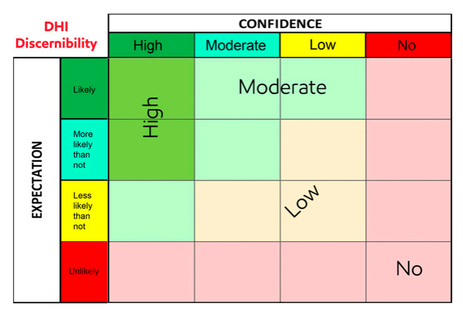

```{python}
import altair as alt
import numpy as np
import pandas as pd

from ldstats import ConfusionMatrix, DirichletConfusionMatrix
from src.plotting import apply_lex_altair_theme

counts = {
    "tp": 25,
    "fp": 2,
    "fn": 15,
    "tn": 30,
}

multi_counts = {
    "oil": {"dhi": 25, "no_dhi": 8},
    "gas": {"dhi": 18, "no_dhi": 4},
    "fizz": {"dhi": 10, "no_dhi": 12},
    "water": {"dhi": 4, "no_dhi": 25},
    "shale": {"dhi": 1, "no_dhi": 30},
}

prior_alpha = 1.0
n_simulations = 5000

alt.data_transformers.disable_max_rows()
apply_lex_altair_theme()
```


## Direct Hydrocarbon Indicators

Direct Hydrocarbon Indicators (DHIs) are anomalous seismic amplitudes driven by the
presence of hydrocarbons in rock. In the best case they create structurally conformant
"flat spots" in seismic data, which provide very strong evidence for hydrocarbon
presence. 

I won't go into details about the underlying physics in this post, focussing more on how
to handle them probabilistically. DHIs are not perfect indicators, and how to integrate
their presence or absence in oil and gas exploration risking is often the subject of
debate.

A recent discussion about a paper[^exxon-dhi-2025] had me realise I have many thoughts
on this topic, so I decided to write them down here.

The first place I go with this is the analogy to medical testing. A DHI can be seen as a
kind of "test" that provides imperfect information about some outcome (the presence or
absence of hydrocarbons, in the simplest binary case). This framing falls into the realm
of [confusion matrices](https://en.wikipedia.org/wiki/Confusion_matrix). 

Using confusion matrices to quantify how probabilities are updated in the presence or
absence of DHIs is very useful, and also yields some unintuitive results that I think
are often neglected during the lively arguments that often spring up around them.

First, some quick background on confusion matrices and Bayes, before going back to the
specific case of DHIs:

## Confusion matrices

Confusion matrices, in their simplest form, separate observations into four categories,
which map well onto a medical testing context:

|                      | Disease present ($H$) | Disease absent ($\neg H$) |
|----------------------|-----------------------|-----------------------------|
| **Test positive (+)**| True Positive (TP)    | False Positive (FP)         |
| **Test negative (-)**| False Negative (FN)   | True Negative (TN)          |

They can be generalized to multi-outcome classification, as well, which I'll get to
later in this post.

A dataset that classifies observations into these buckets can be used to do a lot of
helpful inference about the strength of evidence that a test provides towards some
hypothesis (H).

In the case of oil and gas prospecting in the presence of DHIs, the buckets become:

|                    | Hydrocarbons present ($H$) | Hydrocarbons absent ($\neg H$) |
|--------------------|----------------------------|----------------------------------|
| **DHI observed (+)** | True Positive (TP)         | False Positive (FP)              |
| **No DHI observed (-)** | False Negative (FN)        | True Negative (TN)               |

The most important calculations, that will get us to bayesian updating are as follows:

#### Sensitivity

$$
\begin{aligned}
\text{Sensitivity} &= P(+ \mid H) \\[10pt]
&= \frac{TP}{TP + FN}
\end{aligned}
$$

Sensitivity is the true-positive rate: how often the test is positive when the
hypothesis $H$ is true.

#### Specificity

$$
\begin{aligned}
\text{Specificity} &= P(- \mid \neg H) \\[10pt]
&= \frac{TN}{TN + FP}
\end{aligned}
$$

Specificity is the true-negative rate: how often the test is negative when the
hypothesis $H$ is false.

#### Likelihood Ratios

$$
\begin{aligned}
\mathrm{LR}^{+} &= \frac{P(+ \mid H)}{P(+ \mid \neg H)} \\[10pt]
&= \frac{\text{Sensitivity}}{1 - \text{Specificity}}
\end{aligned}
$$

Positive likelihood ratio tells how strongly a positive test result shifts evidence
toward $H$.

$$
\begin{aligned}
\mathrm{LR}^{-} &= \frac{P(- \mid H)}{P(- \mid \neg H)} \\[10pt]
&= \frac{1 - \text{Sensitivity}}{\text{Specificity}}
\end{aligned}
$$

Negative likelihood ratio tells how strongly a negative test result shifts evidence away
from $H$.

Notice that we have both positive and negative likelihood ratios, they are not the same.
This will become important.

## Using likelihood ratios with Bayes

A source of confusion and frustration: the probability we care about is not 

$P(+ \mid H)$ -- The probability of observing the test result, given our hypothesis is
true, 

but actually

$P(H \mid +)$ -- The probability our hypothesis is true, given the test result.

There is at least [one book](https://aubreyclayton.com/bernoulli) written on this topic
and it may leave you convinced that this difference is why statistics, science and
basically everything else, suck. I recommend it!

Lucky for us it is an easy fix, in this case. We can calculate that probability using
Bayes theorem:

$$
P(H \mid +) = \frac{P(+ \mid H)P(H)}{P(+)}
$$

$P(H)$ is the prior probability for the hypothesis (how likely we think it is before
looking at evidence), which we can argue over, but is at least intuitive to think about.
In the oil and gas context, this is the geological chance of success (COS), importantly
without regard for the DHI.

$P(+)$ is the probability... of the evidence. Which is annoying to calculate in the best
case, and in worse (and common) cases, actually impossible.

Fortunately, we can rearrange things in this context to make the calculation convenient.

### Using odds to make Bayes easier

If I had any advice for making Bayes less confusing, it would be to think (and
calculate) in terms of odds, not probabilities.

Converting to odds is simply done:

$$
\text{Prior odds} = \frac{P(H)}{1 - P(H)}
$$

Then, the math works out that the posterior odds are calculated as the prior odds
multiplied by the likelihood ratio, which we calculated using the confusion matrix:

$$
\text{Posterior odds} = \text{Prior odds} \times \mathrm{LR}^{+}
$$

Converting back from odds to probability gets us to the probability we care about:

$$
P(H \mid +) = \frac{\text{Posterior odds}}{1 + \text{Posterior odds}}
$$

If you are so inclined, log-transforming odds turns the multiplication into addition,
which is easier to work with:

$$
\log\!\left(\text{Posterior odds}\right)
= \log\!\left(\text{Prior odds}\right) + \log\!\left(\mathrm{LR}^{+}\right)
$$

This might seem like a lot of faff, but once you get your head around it Bayes becomes
a lot more intuitive, and rough mental calculations become possible.

## Neglecting the negative case

Something that struck me while reading the paper is that the data used is described as a
global database of previous wildcat wells and their postdrill results. This includes DHI
and non DHI supported wildcats. That is great, and it is no doubt one of the largest
datasets of its kind. 

The issue is that the paper then focusses on the DHI supported data only, using a 185
row subset of the dataset in a supervised machine learning DHI rating system. 

But all those wildcats drilled without DHI support are an essential part of the dataset!

In fact, a Bayesian update can't be calculated without them, due to the absence of the
False Negative and True Negative quadrants in the confusion matrix. These are needed to
compute Sensitivity and Specificity, which are in turn needed for computing Likelihood
Ratios. 

This has some consequences that I'll go into more in the following sections.

## Example dataset

Imagine we've catalogued all prospects over a region into a simple dataset, noting when
hydrocarbons are encountered and when a DHI is present or absent. For now, we're
ignoring other covariates like depth, data quality etc:

```{python}

count_table = pd.DataFrame(
    {
        "Outcome": [
            "DHI | HCs (True Positive)",
            "DHI | No HCs (False Positive)",
            "No DHI | HCs (False Negative)",
            "No DHI | No HCs (True Negative)",
        ],
        "Count": [counts["tp"], counts["fp"], counts["fn"], counts["tn"]],
    }
)

count_table.set_index("Outcome")
```

Note that, despite DHIs being the thing we care about when tabulating this data, we are
tracking all the times a DHI _was absent_, as well.

Using these counts directly, we can compute sensitivity, specificity, and likelihood
ratios:

```{python}
sensitivity = counts["tp"] / (counts["tp"] + counts["fn"])
specificity = counts["tn"] / (counts["tn"] + counts["fp"])
lr_positive = sensitivity / (1 - specificity)
lr_negative = (1 - sensitivity) / specificity
```

```{python}
from IPython.display import Markdown, display

tp = counts["tp"]
fp = counts["fp"]
fn = counts["fn"]
tn = counts["tn"]

calc_tex = f"""
$$
\\begin{{aligned}}
\\text{{Sensitivity}}
&= \\frac{{TP}}{{TP + FN}} \\\\
&= \\frac{{{tp}}}{{{tp + fn}}} \\\\[8px]
&= {sensitivity:.4f}
\\end{{aligned}}
$$

$$
\\begin{{aligned}}
\\text{{Specificity}}
&= \\frac{{TN}}{{TN + FP}} \\\\
&= \\frac{{{tn}}}{{{tn + fp}}} \\\\[8px]
&= {specificity:.4f}
\\end{{aligned}}
$$

$$
\\begin{{aligned}}
\\mathrm{{LR}}^{{+}}
&= \\frac{{\\text{{Sensitivity}}}}{{1 - \\text{{Specificity}}}} \\\\
&= \\frac{{{sensitivity:.4f}}}{{1 - {specificity:.4f}}} \\\\[8px]
&= {lr_positive:.4f}
\\end{{aligned}}
$$

$$
\\begin{{aligned}}
\\mathrm{{LR}}^{{-}}
&= \\frac{{1 - \\text{{Sensitivity}}}}{{\\text{{Specificity}}}} \\\\
&= \\frac{{1 - {sensitivity:.4f}}}{{{specificity:.4f}}} \\\\[8px]
&= {lr_negative:.4f}
\\end{{aligned}}
$$
"""

display(Markdown(calc_tex))
```

Now we can plug whatever prior probability we want into Bayes theorem along with the
likelihood ratios and calculate posterior probabilities.


## Probability updates

Probability updates are often visualized with a prior vs posterior crossplot, where a
diagonal line indicates no change, and posterior probabilities are plotted as a line
bowing out from it. This makes visual the update that occurs at any prior probability,
given the presence or absence of the DHI:

```{python}
cm = ConfusionMatrix.binary(
    tp=counts["tp"],
    fp=counts["fp"],
    fn=counts["fn"],
    tn=counts["tn"],
    positive_state_label="hc",
    negative_state_label="no_hc",
    positive_observation="dhi",
    negative_observation="no_dhi",
)

dcm = DirichletConfusionMatrix.binary(
    tp=counts["tp"],
    fp=counts["fp"],
    fn=counts["fn"],
    tn=counts["tn"],
    positive_state_label="hc",
    negative_state_label="no_hc",
    positive_observation="dhi",
    negative_observation="no_dhi",
    prior_alpha=prior_alpha,
    n_simulations=n_simulations,
)
```

```{python}
prior_positive = np.linspace(0.001, 0.999, 100)
prior_states = np.column_stack([1.0 - prior_positive, prior_positive])


def summarize(samples: np.ndarray) -> dict[str, np.ndarray]:
    return {
        "mean": np.mean(samples, axis=1),
        "q005": np.quantile(samples, 0.005, axis=1),
        "q995": np.quantile(samples, 0.995, axis=1),
        "q10": np.quantile(samples, 0.10, axis=1),
        "q90": np.quantile(samples, 0.90, axis=1),
        "q25": np.quantile(samples, 0.25, axis=1),
        "q75": np.quantile(samples, 0.75, axis=1),
    }


posterior_dhi = dcm.posterior_state_distribution(
    state="hc",
    prior_states=prior_states,
    observation="dhi",
    size=n_simulations,
)
posterior_no_dhi = dcm.posterior_state_distribution(
    state="hc",
    prior_states=prior_states,
    observation="no_dhi",
    size=n_simulations,
)

summary_dhi = summarize(posterior_dhi)
summary_no_dhi = summarize(posterior_no_dhi)

df_dhi = pd.DataFrame(
    {
        "prior": prior_positive,
        "case": "DHI observed",
        "mean": summary_dhi["mean"],
        "q005": summary_dhi["q005"],
        "q995": summary_dhi["q995"],
        "q10": summary_dhi["q10"],
        "q90": summary_dhi["q90"],
        "q25": summary_dhi["q25"],
        "q75": summary_dhi["q75"],
    }
)

df_no_dhi = pd.DataFrame(
    {
        "prior": prior_positive,
        "case": "No DHI observed",
        "mean": summary_no_dhi["mean"],
        "q005": summary_no_dhi["q005"],
        "q995": summary_no_dhi["q995"],
        "q10": summary_no_dhi["q10"],
        "q90": summary_no_dhi["q90"],
        "q25": summary_no_dhi["q25"],
        "q75": summary_no_dhi["q75"],
    }
)

df = pd.concat([df_dhi, df_no_dhi], ignore_index=True)
identity = pd.DataFrame({"x": [0.0, 1.0], "y": [0.0, 1.0]})

base = alt.Chart(df).encode(
    x=alt.X("prior:Q", title="Prior COS", scale=alt.Scale(domain=[0, 1])),
    y=alt.Y("mean:Q", title="Posterior COS", scale=alt.Scale(domain=[0, 1])),
)

identity_line = (
    alt.Chart(identity)
    .mark_line(strokeDash=[6, 4], color="#a8a29e", strokeWidth=1.25)
    .encode(x="x:Q", y="y:Q")
)


def case_layers(case_label: str, color: str) -> alt.LayerChart:
    case_filter = alt.datum.case == case_label

    band_99 = base.transform_filter(case_filter).mark_area(color=color, opacity=0.08).encode(
        y=alt.Y("q005:Q"),
        y2="q995:Q",
    )
    band_80 = base.transform_filter(case_filter).mark_area(color=color, opacity=0.14).encode(
        y=alt.Y("q10:Q"),
        y2="q90:Q",
    )
    band_50 = base.transform_filter(case_filter).mark_area(color=color, opacity=0.24).encode(
        y=alt.Y("q25:Q"),
        y2="q75:Q",
    )
    mean_line = base.transform_filter(case_filter).mark_line(color=color, strokeWidth=2.2)

    return band_99 + band_80 + band_50 + mean_line


def mean_case_layer(case_label: str, color: str) -> alt.Chart:
    case_filter = alt.datum.case == case_label
    return base.transform_filter(case_filter).mark_line(color=color, strokeWidth=2.2)


mean_chart = (
    identity_line
    + mean_case_layer("DHI observed", "#32cd32")
    + mean_case_layer("No DHI observed", "#ff8c00")
).properties(width=520, height=520)

mean_chart
```

This creates an intuitive sense that stronger evidence (a high likelihood ratio) causes
more _flex_ in the probability, either up or down.

A DHI gives the chance of success a boost (green line), whereas the absence of a DHI
hurts it (orange line).

For example, if our geological COS for a prospect is at 50%, the update a DHI provides
us, given the likelihood ratios derived from the confusion matrix, are as shown:

```{python}
reference_prior = 0.5
reference_prior_states = np.array([[1.0 - reference_prior, reference_prior]])

posterior_dhi_reference = cm.posterior_probability(
    prior=reference_prior,
    test_positive=True
)

posterior_no_dhi_reference = cm.posterior_probability(
    prior=1 - reference_prior,
    test_positive=False
)

reference_update = pd.DataFrame(
    {
        "Case": ["DHI observed", "No DHI observed"],
        "Prior COS": [reference_prior, reference_prior],
        "Posterior COS": [
            posterior_dhi_reference,
            posterior_no_dhi_reference,
        ],
    }
)

reference_update.set_index("Case")
```

There are a few things to note here.

For one thing, the updates are not linear. Postively updating from 0.1 appears more
dramatic than updating from 0.9. And in the probability domain, this is true, but in the
log-odds domain these lines are all parallel, changing likelihood ratios just shifts
them up and down on the posterior log odds axis. It is useful to internalize this
because it leads you to realise there's nothing magical happening with those curves, the
_same information_ is being incorporated into the posterior -- where you start from
(your prior) isn't changing the underlying mechanics.

The other important thing is that _positive and negative updates are not symmetrical_.
The supporting evidence a DHI provides is not the same as evidence against if the DHI is
absent.

This is unintuitive (if you ask me, at least) and it makes ruling out prospects with no
DHI support a potentially irrational thing to do. If DHI specificity is not very high
(as in this example), it indicates DHI absence is not a deal breaker for a prospect,
even if DHI presence would make it a slam dunk!

So if all the geological elements are very high confidence, and you've agreed to a COS
of 0.85, don't let a geophysicist crash the party without providing real justification.

If that geophysicist draws a version of the above plot patiently explaining why you, the
simple minded geologist, aren't getting it, ask them why the plot is symmetrical. 

They might get smug and say something like:

> _Well logically, the confidence the DHI gives us, and the confidence it takes away,
> are the same thing_

but they'll be wrong.

Most of these "probability update" crossplots I've seen on this topic (including the one in
the paper I mentioned) are symmetrical, so I think this point is often missed.

This is a downstream consequence of neglecting the non DHI supported data, as this takes
probability out of its full context, leading to people using precise numbers to be
precisely wrong.

## Better handling uncertainty

Confusion matrices happen to fit nicely into something called a
[Dirichlet-multinomial](https://en.wikipedia.org/wiki/Dirichlet-multinomial_distribution)
conjugate model. I've written briefly about the nice properties of this distribution
[here](https://nick-dorsch.github.io/blog/posts/dirichlet_geo/).

Basically, since each quadrant of the confusion matrix is exclusive and exhaustive (all
observations are one of TP, TN, FP, FN), those counts can be used to parametrize a
distribution over their respective frequencies, which amounts to a set of probabilities
that form a unit simplex (sum to 1.0). 

The $\alpha$ vector that parameterizes the Dirichlet distribution is simply the count in
each bin of the confusion matrix, with a prior (for example, a vector of 1.0 for uniform
priors). This is very convenient, as new data can just be encoded as updating counts,
yielding an updated distribution.

Since data is very scarce in this context (drilling wells is expensive), this is a nice
property to take advantage of. It means that quantities like the Sensitivity and
Specificity, as well as the positive and negative Likelihood Ratios, are estimated as
probability distributions, rather than deterministic quantities. The uncertainty of the
estimates is a function of the number of observations in the dataset. Many observations
means less uncertainty.

To see what the Dirichlet model is doing directly, we can look at the sampled
probability for each confusion-matrix category:

```{python}
dirichlet_alpha = np.array(
    [
        counts["tp"] + prior_alpha,
        counts["fp"] + prior_alpha,
        counts["fn"] + prior_alpha,
        counts["tn"] + prior_alpha,
    ]
)

draws = np.random.dirichlet(dirichlet_alpha, size=n_simulations)
tp_draw, fp_draw, fn_draw, tn_draw = draws.T

category_df = pd.DataFrame(
    {
        "value": np.concatenate([tp_draw, fp_draw, fn_draw, tn_draw]),
        "category": ["TP"] * n_simulations
        + ["FP"] * n_simulations
        + ["FN"] * n_simulations
        + ["TN"] * n_simulations,
    }
)

total_counts = counts["tp"] + counts["fp"] + counts["fn"] + counts["tn"]
category_det_df = pd.DataFrame(
    {
        "value": [
            counts["tp"] / total_counts,
            counts["fp"] / total_counts,
            counts["fn"] / total_counts,
            counts["tn"] / total_counts,
        ],
        "category": ["TP", "FP", "FN", "TN"],
    }
)

category_palette = ["TP", "FP", "FN", "TN"]
category_colors = ["#32cd32", "#ff8c00", "#dc2626", "#1f77b4"]

category_line = (
    alt.Chart(category_df)
    .transform_density(
        density="value",
        as_=["value", "density"],
        groupby=["category"],
        extent=[0, 1],
    )
    .mark_line(strokeWidth=2)
    .encode(
        x="value:Q",
        y=alt.Y("density:Q", axis=None),
        color=alt.Color(
            "category:N",
            title="Category",
            legend=alt.Legend(orient="top-right"),
            scale=alt.Scale(domain=category_palette, range=category_colors),
        ),
    )
)

category_det_rules = (
    alt.Chart(category_det_df)
    .mark_rule(strokeDash=[6, 4], strokeWidth=1.6)
    .encode(
        x="value:Q",
        color=alt.Color(
            "category:N",
            legend=None,
            scale=alt.Scale(domain=category_palette, range=category_colors),
        ),
    )
)

(category_line + category_det_rules).properties(
    width="container",
    height=320,
)
```

The frequency that each category is present in the dataset are plotted as vertical
lines, but there are a range of plausible values surrounding them that could equally
have given rise to our dataset.

The resulting distributions for sensitivity and specificity (calculated by plugging in
the array of probability values, instead of the single calculated values) look like
this:

```{python}

sensitivity_samples = tp_draw / (tp_draw + fn_draw)
specificity_samples = tn_draw / (tn_draw + fp_draw)

metrics_df = pd.DataFrame(
    {
        "value": np.concatenate([sensitivity_samples, specificity_samples]),
        "metric": ["Sensitivity"] * n_simulations + ["Specificity"] * n_simulations,
    }
)

deterministic_df = pd.DataFrame(
    {
        "value": [
            counts["tp"] / (counts["tp"] + counts["fn"]),
            counts["tn"] / (counts["tn"] + counts["fp"]),
        ],
        "metric": ["Sensitivity", "Specificity"],
    }
)

metric_palette = ["Sensitivity", "Specificity"]
metric_colors = ["#32cd32", "#1f77b4"]

metric_density = (
    alt.Chart(metrics_df)
    .transform_density(
        density="value",
        as_=["value", "density"],
        groupby=["metric"],
        extent=[0, 1],
    )
    .mark_line(strokeWidth=2)
    .encode(
        x=alt.X("value:Q", title="Value", scale=alt.Scale(domain=[0, 1])),
        y=alt.Y("density:Q", axis=None),
        color=alt.Color(
            "metric:N",
            title="Metric",
            legend=alt.Legend(orient="top-left"),
            scale=alt.Scale(domain=metric_palette, range=metric_colors),
        ),
    )
)

metric_line = (
    alt.Chart(metrics_df)
    .transform_density(
        density="value",
        as_=["value", "density"],
        groupby=["metric"],
        extent=[0, 1],
    )
    .mark_line(strokeWidth=2)
    .encode(
        x="value:Q",
        y=alt.Y("density:Q", axis=None),
        color=alt.Color(
            "metric:N",
            legend=None,
            scale=alt.Scale(domain=metric_palette, range=metric_colors),
        ),
    )
)

deterministic_rules = (
    alt.Chart(deterministic_df)
    .mark_rule(strokeDash=[6, 4], strokeWidth=1.8)
    .encode(
        x="value:Q",
        color=alt.Color(
            "metric:N",
            legend=None,
            scale=alt.Scale(domain=metric_palette, range=metric_colors),
        ),
    )
)

deterministic_text = (
    alt.Chart(deterministic_df)
    .mark_text(align="left", dx=6, dy=12)
    .encode(
        x="value:Q",
        y=alt.value(0),
        color=alt.Color(
            "metric:N",
            legend=None,
            scale=alt.Scale(domain=metric_palette, range=metric_colors),
        ),
        text=alt.Text("value:Q", format=".3f"),
    )
)

(metric_density + metric_line + deterministic_rules + deterministic_text).properties(
    width="container",
    height=320,
)
```

And finally, likelhood ratios (and the associated prior to posterior update) are
represented as distributions, which lets us show a range of plausible probability
updates given our data:

```{python}
full_distribution_chart = (
    identity_line
    + case_layers("DHI observed", "#32cd32")
    + case_layers("No DHI observed", "#ff8c00")
).properties(width=520, height=520)

full_distribution_chart
```

Now, not only is the asymmetry of updates evident, but the asymmetry in the uncertainty
about them is too. The way these differences come about is a bit of a headache, but is
all a function of the prior, the number of datapoints we have in each category, and the
equations shown in the earlier section.

### Example Prior = `{python} reference_prior`

```{python}
fixed_prior_states = np.array([[1.0 - reference_prior, reference_prior]])

posterior_dhi_fixed = dcm.posterior_state_distribution(
    state="hc",
    prior_states=fixed_prior_states,
    observation="dhi",
    size=2000,
)[0]

posterior_no_dhi_fixed = dcm.posterior_state_distribution(
    state="hc",
    prior_states=fixed_prior_states,
    observation="no_dhi",
    size=2000,
)[0]

density_samples = pd.concat(
    [
        pd.DataFrame(
            {
                "P(Geological)": posterior_dhi_fixed,
                "case": "Pg | DHI",
            }
        ),
        pd.DataFrame(
            {
                "P(Geological)": posterior_no_dhi_fixed,
                "case": "Pg | No DHI",
            }
        ),
    ],
    ignore_index=True,
)

prior_marker = pd.DataFrame(
    {
        "P(Geological)": [reference_prior],
        "label": [f"Prior P(Geological) = {reference_prior:.2f}"],
    }
)

palette_domain = ["Pg | DHI", "Pg | No DHI"]
palette_range = ["#32cd32", "#ff8c00"]

density_area = (
    alt.Chart(density_samples)
    .transform_density(
        density="P(Geological)",
        as_=["P(Geological)", "density"],
        groupby=["case"],
        extent=[0, 1],
    )
    .mark_area(opacity=0.22)
    .encode(
        x=alt.X(
            "P(Geological):Q",
            title="COS",
            scale=alt.Scale(domain=[0, 1]),
            axis=alt.Axis(grid=False),
        ),
        y=alt.Y("density:Q", axis=None),
        color=alt.Color(
            "case:N",
            title=None,
            scale=alt.Scale(domain=palette_domain, range=palette_range),
        ),
        fill=alt.Fill(
            "case:N",
            legend=None,
            scale=alt.Scale(domain=palette_domain, range=palette_range),
        ),
    )
)

density_line = (
    alt.Chart(density_samples)
    .transform_density(
        density="P(Geological)",
        as_=["P(Geological)", "density"],
        groupby=["case"],
        extent=[0, 1],
    )
    .mark_line(strokeWidth=2)
    .encode(
        x="P(Geological):Q",
        y=alt.Y("density:Q", axis=None),
        color=alt.Color(
            "case:N",
            legend=None,
            scale=alt.Scale(domain=palette_domain, range=palette_range),
        ),
    )
)

prior_rule = (
    alt.Chart(prior_marker)
    .mark_rule(strokeDash=[6, 4], color="#a8a29e", strokeWidth=1.8)
    .encode(x="P(Geological):Q")
)

prior_text = (
    alt.Chart(prior_marker)
    .mark_text(align="left", dx=6, dy=12, color="#78716c")
    .encode(x="P(Geological):Q", y=alt.value(0), text="label:N")
)

fixed_prior_chart = (density_area + density_line + prior_rule + prior_text).properties(
    width="container",
    height=320,
).configure_view(strokeWidth=0)

fixed_prior_chart
```

It may seem odd to arrive at a range of possible posterior probabilities when we're
accustomed to using single numbers. But, consider that we don't know how strong the DHI
is as an indicator, we have been tricked before, and we don't have much data. That means
there is a fair amount of _uncertainty_ about what our posterior probability could be
when considering the DHI. It is possible to propagate this uncertainty into volumetric
models, but in practice we usually just run with an agreed upon single value.

Whether the full distribution is used or not, the point is it is unwise to get hung up
on a single _correct_ value, when there is a lot of uncertainty left on the table.

## Not all DHIs are the same

Fancy statistics aside, something this approach still leaves out is that _not all DHIs
are equal_ in terms of the information they provide. A clear flat spot that strongly
conforms to structure, in a lithology and depth window that we physically expect should
show such a contrast, is very convincing evidence of hydrocarbon presence. In contrast,
an amorphous amplitude anomaly that we think may correspond to a sand body in poorly
processed seismic data, is much less convincing.

Some additional variables that should be included are:

**Depth:** it is expected that acoustic impedance contrasts, and the respective effects
of pore fluid will change with depth, leading to different DHI characteristics

](media/ai-depth.png)

**Structural Conformance:** DHI flat spots that conform well to structure are expected
to be more reliable, so an ordinal index tracking this should be included in the model

**Signal Strength:** The strength of the amplitude anomaly should increase confidence in
its validity (vs random noise)

**Data Quality:** Lower quality, noisier seismic data yields less confidence than
anomalies observed on high quality datasets

The paper that led to me writing this has a nice risk-matrix showing their schema for
rating DHI "discernability", which considers both the expectation of a DHI response
(given the geological and geophysical context) and the confidence in the data.



Their discernability metric appears to be equivalent to the likelihood ratio applied
here, but is estimated using the above matrix.

With a rich dataset, I would model DHI as a diagnostic signal conditional on hydrocarbon
state and prospect context, then convert that into context-dependent likelihood ratios
for Bayesian updating. This moves out of classification and into logistic regression.

$$
Y_i \sim \operatorname{Bernoulli}(\pi_i)
$$

$$
\operatorname{logit}\!\big(P(Y_i=1 \mid H_i=h,\mathbf{x}_i)\big)
= \alpha_h + f_h(d_i) + \mathbf{x}_i^\top \boldsymbol{\gamma}_h
$$

Where:

- $i$ indexes prospect reservoir intersections 
- $Y_i$ is the observed DHI indicator ($1=\mathrm{DHI\ present},\;0=\mathrm{DHI\
absent}$)
- $H_i$ is hydrocarbon state ($1=\mathrm{HC},\;0=\mathrm{no\ HC}$)
- $\pi_i = P(Y_i=1 \mid H_i,\mathbf{x}_i)$
- $d_i$ is depth
- $\mathbf{x}_i$ are additional predictors (for example structural conformance, signal
strength, data quality)
- $\alpha_h$, $f_h(\cdot)$, and $\boldsymbol{\gamma}_h$ are
hydrocarbon-state-specific intercepts/effects

This gives two conditional DHI-response models: one for hydrocarbon presence and one for
hydrocarbon absence. From these, context dependent likelihood ratios are calculated as:

$$
\operatorname{LR}^{+}(\mathbf{x})
= \frac{P(Y=1 \mid H=1,\mathbf{x})}{P(Y=1 \mid H=0,\mathbf{x})}
$$

$$
\operatorname{LR}^{-}(\mathbf{x})
= \frac{P(Y=0 \mid H=1,\mathbf{x})}{P(Y=0 \mid H=0,\mathbf{x})}
$$

These context-dependent likelihood ratios can then be used with prior odds to obtain
posterior $P(H=1\mid Y,\mathbf{x})$ for new prospects. 

Think of the update crossplot above bowing in and out depending on the depth, data
quality, structural conformance etc of the prospect in question. That is essentially
what the model would be doing.

Incorporating the physics more directly in a model is something I'm interested in
playing with as well, though I've not done it before. Incorporating rock physics data
means the acoustic impedance vs depth trend could be estimated, which along with fluid
substitution would mean DHI amplitude anomalies could be simulated physically for
different pore fluids and reservoirs, providing posterior probabilities over each
scenario given what is observed at the target interval.

## Is success and failure really enough?

A final extension of this is based on a fairly simple point:

Why are we talking about "success" and "failure" as if those are the canonical outcomes
of drilling a prospect?

In the context of DHIs and oil and gas prospecting, a "failure" could mean several
different things:

1. There is gas at the anomaly, and we wanted oil
2. There is gas at the anomaly, but it is at residual saturation and non economic
3. The reservoir is water saturated
4. There is no reservoir at the anomaly

And a "success" depends on what we care about... but DHI's don't care about that.

Confusion matrices, as I mentioned earlier, can be extended to multiple outcome states,
where the "test" of the DHI has an associated likelihood ratio for each of them. 

For this example I'll use the following states, though more or less could be included as
long as they represent an exhaustive set:

1. Oil
2. Gas
3. Fizz (low saturation gas)
4. Water
5. Shale (no reservoir)

A simple toy dataset for these expanded states might look like this:

```{python}
multi_count_table = pd.DataFrame(
    {
        "State": ["Oil", "Gas", "Fizz", "Water", "Shale"],
        "DHI observed": [
            multi_counts["oil"]["dhi"],
            multi_counts["gas"]["dhi"],
            multi_counts["fizz"]["dhi"],
            multi_counts["water"]["dhi"],
            multi_counts["shale"]["dhi"],
        ],
        "No DHI observed": [
            multi_counts["oil"]["no_dhi"],
            multi_counts["gas"]["no_dhi"],
            multi_counts["fizz"]["no_dhi"],
            multi_counts["water"]["no_dhi"],
            multi_counts["shale"]["no_dhi"],
        ],
    }
)

multi_count_table.set_index("State")
```

```{python}
dcm_multi = DirichletConfusionMatrix(
    counts=[
        [multi_counts["oil"]["no_dhi"], multi_counts["oil"]["dhi"]],
        [multi_counts["gas"]["no_dhi"], multi_counts["gas"]["dhi"]],
        [multi_counts["fizz"]["no_dhi"], multi_counts["fizz"]["dhi"]],
        [multi_counts["water"]["no_dhi"], multi_counts["water"]["dhi"]],
        [multi_counts["shale"]["no_dhi"], multi_counts["shale"]["dhi"]],
    ],
    state_labels=["oil", "gas", "fizz", "water", "shale"],
    observation_labels=["no_dhi", "dhi"],
    positive_observation="dhi",
    prior_alpha=prior_alpha,
    n_simulations=n_simulations,
)
```

Using a prior probability over each state, we can sample the posterior state
probabilities given a DHI and visualize the uncertainty for each:

```{python}
multi_state_labels = ["oil", "gas", "fizz", "water", "shale"]
multi_prior_weights = np.array([4, 8, 2, 1, 1])
multi_prior_states = multi_prior_weights / np.sum(multi_prior_weights)

multi_prior_table = pd.DataFrame(
   {
       "State": [s.title() for s in multi_state_labels],
       "Prior Probability": multi_prior_states,
   }
)

multi_prior_table.set_index("State")
```

```{python}
multi_posterior_dhi = dcm_multi.posterior_states_distribution(
    prior_states=multi_prior_states,
    observation="dhi",
    size=n_simulations,
)

multi_density_df = pd.DataFrame(
    {
        "value": np.concatenate(
            [multi_posterior_dhi[:, i] for i in range(len(multi_state_labels))]
        ),
        "state": sum([[label] * n_simulations for label in multi_state_labels], []),
    }
)

multi_state_colors = ["#16a34a", "#dc2626", "#ec4899", "#3b82f6", "#6b7280"]

multi_density_line = (
    alt.Chart(multi_density_df)
    .transform_density(
        density="value",
        as_=["value", "density"],
        groupby=["state"],
        extent=[0, 1],
    )
    .mark_line(strokeWidth=2)
    .encode(
        x=alt.X(
            "value:Q",
            title="Posterior probability P(state | DHI)",
            scale=alt.Scale(domain=[0, 1]),
        ),
        y=alt.Y("density:Q", axis=None),
        color=alt.Color(
            "state:N",
            title="State",
            legend=alt.Legend(orient="top-right"),
            scale=alt.Scale(domain=multi_state_labels, range=multi_state_colors),
        ),
    )
)

multi_density_line.properties(
    width="container",
    height=320,
)
```

And we can do the same update for the absence of a DHI:

```{python}
multi_posterior_no_dhi = dcm_multi.posterior_states_distribution(
    prior_states=multi_prior_states,
    observation="no_dhi",
    size=n_simulations,
)

multi_density_no_dhi_df = pd.DataFrame(
    {
        "value": np.concatenate(
            [multi_posterior_no_dhi[:, i] for i in range(len(multi_state_labels))]
        ),
        "state": sum([[label] * n_simulations for label in multi_state_labels], []),
    }
)

multi_no_dhi_density_line = (
    alt.Chart(multi_density_no_dhi_df)
    .transform_density(
        density="value",
        as_=["value", "density"],
        groupby=["state"],
        extent=[0, 1],
    )
    .mark_line(strokeWidth=2)
    .encode(
        x=alt.X(
            "value:Q",
            title="Posterior probability P(state | No DHI)",
            scale=alt.Scale(domain=[0, 1]),
        ),
        y=alt.Y("density:Q", axis=None),
        color=alt.Color(
            "state:N",
            title="State",
            legend=alt.Legend(orient="top-right"),
            scale=alt.Scale(domain=multi_state_labels, range=multi_state_colors),
        ),
    )
)

multi_no_dhi_density_line.properties(
    width="container",
    height=320,
)
```

This shifts from thinking in terms of _"will the prospect succeed or fail"_ to a more
granular _"what do we expect to find when we drill the prospect"_ set of scenarios.
Fizz, water and shale can be summed to a single "Failure" scenario, but the oil and gas
scenarios certainly benefit from separate scenario based economic analyses.

The challenge with this kind of approach is calibration -- the more categories are
split, the more sparse our datasets are. There are ways of mitigating this in bayesian
statistics via hierarchical models/partial pooling, but it is still a challenge. 

## Closing thoughts

Absent the data, it can still be useful to have these frameworks in mind, as more
subjective inputs can still be put through a probabilistically rigorous process, meaning
that at the very least, the outputs are logical consequences of the inputs.

And maybe this all seems over the top. "Don't overscience it" is a refrain I've heard
plenty of times in my career. I'm sympathetic to not tricking ourselves into being
precisely wrong with overly complicated theories. That is part of why bayesian methods
appeal to me so much -- uncertainty is a first class citizen.

But we are usually talking about hundreds of millions of dollar decisions in this
context, so maybe sciencing the hell out of it is a good investment?

Thanks for reading.

[^exxon-dhi-2025]: Monigle, P. W., Hedayati, T. S., and Goulding, F. J., 2025,
Integrated and improved direct hydrocarbon indicators: A step forward in petroleum risk
discrimination: *AAPG Bulletin*, 109(5), 617-636, https://doi.org/10.1306/04042524030.
