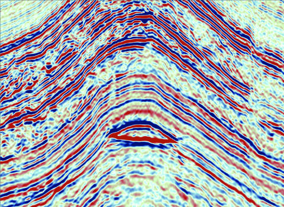

```{python}
import altair as alt
import numpy as np
import pandas as pd

from ldstats import ConfusionMatrix, DirichletConfusionMatrix
from src.plotting import apply_lex_altair_theme

counts = {
    "tp": 25,
    "fp": 1,
    "fn": 20,
    "tn": 30,
}

prior_alpha = 1.0
n_simulations = 1000

apply_lex_altair_theme()
```



## Direct Hydrocarbon Indicators

Direct Hydrocarbon Indicators (DHIs) are anomalous seismic amplitudes driven by the
presence of hydrocarbons in rock. In the best case they create structurally conformant
"flat spots" in seismic data, which provide very strong evidence for hydrocarbon
presence. 

I won't go into details about the underlying physics in this post, more how to handle
them probabilistically. DHIs are not perfect indicators, and how to integrate the
presence or absence of DHIs in oil and gas exploration risking is often the subject of
debate.

Coming from a bayesian perspective, I've developed some ways of thinking about this.

The first is drawing an analogy to medical testing. A DHI can be seen as a kind of
"test" that provides imperfect information about some outcome (the presence or absence
of hydrocarbons, in the simplest binary case). This falls into the realm of [confusion
matrices](https://en.wikipedia.org/wiki/Confusion_matrix). 

Using confusion matrices to quantify how probabilities are updated in the presence or
absence of DHIs is very useful, and also yields some unintuitive results that I think
are often neglected during the lively arguments that often spring up around them.

First, some quick background on confusion matrices, before going back to the specific
case of DHIs:

## Confusion Matrices

Confusion matrices, in their simplest form, separate observations into four categories,
which map well onto a medical testing context:

- True Positive (TP): The test is positive and the patient has the disease
- False Positive (FP): The test is positive but the patient is healthy
- True Negative (TN): The test is negative and the patient is healthy
- False Negative (FN): The test is negative but the patient has the disease

A dataset that classifies observations into these buckets can be used to do a lot of
helpful inference about the strength of evidence that a test provides towards some
hypothesis (H).

In the case of oil and gas prospecting in the presence of DHIs, the buckets become:

- True Positive (TP): A DHI is observed and hydrocarbons are present
- False Positive (FP): A DHI is observed but no hydrocarbons are present
- True Negative (TN): No DHI is observed, and no hydrocarbons are present
- False Negative (FN): No DHI is observed, but hydrocarbons are present

The most important calculations, that will get us to bayesian updating are as follows:

#### Sensitivity

$$
\begin{aligned}
\text{Sensitivity} &= P(+ \mid H) \\[10pt]
&= \frac{TP}{TP + FN}
\end{aligned}
$$

Sensitivity is the true-positive rate: how often the test is positive when the
hypothesis $H$ is true.

#### Specificity

$$
\begin{aligned}
\text{Specificity} &= P(- \mid \neg H) \\[10pt]
&= \frac{TN}{TN + FP}
\end{aligned}
$$

Specificity is the true-negative rate: how often the test is negative when the
hypothesis $H$ is false.

#### Likelihood Ratio

$$
\begin{aligned}
\mathrm{LR}^{+} &= \frac{P(+ \mid H)}{P(+ \mid \neg H)} \\[10pt]
&= \frac{\text{Sensitivity}}{1 - \text{Specificity}}
\end{aligned}
$$

Positive likelihood ratio tells how strongly a positive test result shifts evidence
toward $H$.

$$
\begin{aligned}
\mathrm{LR}^{-} &= \frac{P(- \mid H)}{P(- \mid \neg H)} \\[10pt]
&= \frac{1 - \text{Sensitivity}}{\text{Specificity}}
\end{aligned}
$$

Negative likelihood ratio tells how strongly a negative test result shifts evidence away
from $H$.

## Using Likelihood Ratios with Bayes

A source of confusion and frustration: the probability we care about is not 

$P(+ \mid H)$ -- The probability of observing the test result, given our hypothesis is
true, 

but actually

$P(H \mid +)$ -- The probability our hypothesis is true, given the test result.

There is at least [one book](https://aubreyclayton.com/bernoulli) written on this topic
and it may leave you convinced that this difference is why statistics, science and
basically everything else, suck. I recommend it!

Lucky for us it is an easy fix, in this case. We can calculate that probability using
Bayes theorem:

$$
P(H \mid +) = \frac{P(+ \mid H)P(H)}{P(+)}
$$

$P(H)$ is the prior probability for the hypothesis (how likely we think it is before
looking at evidence), which we can argue over, but is at least intuitive to think about.
In the oil and gas context, this is the geological chance of success (COS), importantly
without regard for the DHI.

$P(+)$ is the probability... of the evidence. Which is annoying to calculate in the best
case, and in worse (and common) cases, actually impossible.

Fortunately, we can rearrange things in this context to make the calculation convenient.

### Using odds to make Bayes easier

If I had any advice for making Bayes less confusing, it would be to think (and
calculate) in terms of odds, not probabilities.


Converting to odds is simply done:

$$
\text{Prior odds} = \frac{P(H)}{1 - P(H)}
$$

Then, the math works out that the posterior odds are calculated as the prior odds
multiplied by the likelihood ratio, which we calculated using the confusion matrix:

$$
\text{Posterior odds} = \text{Prior odds} \times \mathrm{LR}^{+}
$$

Converting back from odds to probability gets us to the probability we care about:

$$
P(H \mid +) = \frac{\text{Posterior odds}}{1 + \text{Posterior odds}}
$$

Log-transforming odds turns the multiplication into addition, which is easier to work
with:

$$
\log\!\left(\text{Posterior odds}\right)
= \log\!\left(\text{Prior odds}\right) + \log\!\left(\mathrm{LR}^{+}\right)
$$

Equivalently, in logit form:

$$
\operatorname{logit}\!\left(P(H \mid +)\right)
= \operatorname{logit}\!\left(P(H)\right) + \log\!\left(\mathrm{LR}^{+}\right)
$$

where the logit transformation is

$$
\operatorname{logit}(p) = \log\!\left(\frac{p}{1 - p}\right)
$$

and the inverse logit transformation (to get back to probability) is

$$
p = \operatorname{logit}^{-1}(x) = \frac{1}{1 + e^{-x}}
$$

This might seem like a lot of faff, but once you get your head around it Bayes becomes
a lot more intuitive, and rough mental calculations become possible.

## Example dataset

Imagine we've catalogued all prospects over a region, noting when hydrocarbons are
encountered and when a DHI is present or absent:

```{python}

count_table = pd.DataFrame(
    {
        "Outcome": [
            "DHI | HCs (True Positive)",
            "DHI | No HCs (False Positive)",
            "No DHI | HCs (False Negative)",
            "No DHI | No HCs (True Negative)",
        ],
        "Count": [counts["tp"], counts["fp"], counts["fn"], counts["tn"]],
    }
)

count_table.set_index("Outcome")
```

## Probability Updates

Often bayesian probability updates are shown with a prior vs posterior crossplot, where
a diagonal line indicates no change, and posterior probabilities are plotted as a line
bowing out from that line. This makes visual the update that occurs at a given prior
probability, given the presence or absence of the DHI:

```{python}
cm = ConfusionMatrix.binary(
    tp=counts["tp"],
    fp=counts["fp"],
    fn=counts["fn"],
    tn=counts["tn"],
    positive_state_label="hc",
    negative_state_label="no_hc",
    positive_observation="dhi",
    negative_observation="no_dhi",
)

dcm = DirichletConfusionMatrix.binary(
    tp=counts["tp"],
    fp=counts["fp"],
    fn=counts["fn"],
    tn=counts["tn"],
    positive_state_label="hc",
    negative_state_label="no_hc",
    positive_observation="dhi",
    negative_observation="no_dhi",
    prior_alpha=prior_alpha,
    n_simulations=n_simulations,
)
```

```{python}
prior_positive = np.linspace(0.001, 0.999, 100)
prior_states = np.column_stack([1.0 - prior_positive, prior_positive])


def summarize(samples: np.ndarray) -> dict[str, np.ndarray]:
    return {
        "mean": np.mean(samples, axis=1),
        "q005": np.quantile(samples, 0.005, axis=1),
        "q995": np.quantile(samples, 0.995, axis=1),
        "q10": np.quantile(samples, 0.10, axis=1),
        "q90": np.quantile(samples, 0.90, axis=1),
        "q25": np.quantile(samples, 0.25, axis=1),
        "q75": np.quantile(samples, 0.75, axis=1),
    }


posterior_dhi = dcm.posterior_state_distribution(
    state="hc",
    prior_states=prior_states,
    observation="dhi",
    size=n_simulations,
)
posterior_no_dhi = dcm.posterior_state_distribution(
    state="hc",
    prior_states=prior_states,
    observation="no_dhi",
    size=n_simulations,
)

summary_dhi = summarize(posterior_dhi)
summary_no_dhi = summarize(posterior_no_dhi)

df_dhi = pd.DataFrame(
    {
        "prior": prior_positive,
        "case": "DHI observed",
        "mean": summary_dhi["mean"],
        "q005": summary_dhi["q005"],
        "q995": summary_dhi["q995"],
        "q10": summary_dhi["q10"],
        "q90": summary_dhi["q90"],
        "q25": summary_dhi["q25"],
        "q75": summary_dhi["q75"],
    }
)

df_no_dhi = pd.DataFrame(
    {
        "prior": prior_positive,
        "case": "No DHI observed",
        "mean": summary_no_dhi["mean"],
        "q005": summary_no_dhi["q005"],
        "q995": summary_no_dhi["q995"],
        "q10": summary_no_dhi["q10"],
        "q90": summary_no_dhi["q90"],
        "q25": summary_no_dhi["q25"],
        "q75": summary_no_dhi["q75"],
    }
)

df = pd.concat([df_dhi, df_no_dhi], ignore_index=True)
identity = pd.DataFrame({"x": [0.0, 1.0], "y": [0.0, 1.0]})

base = alt.Chart(df).encode(
    x=alt.X("prior:Q", title="Prior P(hc)", scale=alt.Scale(domain=[0, 1])),
    y=alt.Y("mean:Q", title="Posterior P(hc)", scale=alt.Scale(domain=[0, 1])),
)

identity_line = (
    alt.Chart(identity)
    .mark_line(strokeDash=[6, 4], color="#a8a29e", strokeWidth=1.25)
    .encode(x="x:Q", y="y:Q")
)


def case_layers(case_label: str, color: str) -> alt.LayerChart:
    case_filter = alt.datum.case == case_label

    band_99 = base.transform_filter(case_filter).mark_area(color=color, opacity=0.08).encode(
        y=alt.Y("q005:Q"),
        y2="q995:Q",
    )
    band_80 = base.transform_filter(case_filter).mark_area(color=color, opacity=0.14).encode(
        y=alt.Y("q10:Q"),
        y2="q90:Q",
    )
    band_50 = base.transform_filter(case_filter).mark_area(color=color, opacity=0.24).encode(
        y=alt.Y("q25:Q"),
        y2="q75:Q",
    )
    mean_line = base.transform_filter(case_filter).mark_line(color=color, strokeWidth=2.2)

    return band_99 + band_80 + band_50 + mean_line


def mean_case_layer(case_label: str, color: str) -> alt.Chart:
    case_filter = alt.datum.case == case_label
    return base.transform_filter(case_filter).mark_line(color=color, strokeWidth=2.2)


mean_chart = (
    identity_line
    + mean_case_layer("DHI observed", "#32cd32")
    + mean_case_layer("No DHI observed", "#ff8c00")
).properties(width=520, height=520)

mean_chart
```

A DHI gives the chance of success a boost (green line), whereas the absence of a DHI
hurts tit (orange line).

For example, if our geological COS for a prospect is at 50%, the update a DHI provides
us, given the likelihood ratios derived from the confusion matrix, are as shown:

```{python}
reference_prior = 0.5
reference_prior_states = np.array([[1.0 - reference_prior, reference_prior]])

posterior_dhi_reference = cm.posterior_probability(
    prior=reference_prior,
    test_positive=True
)

posterior_no_dhi_reference = cm.posterior_probability(
    prior=1 - reference_prior,
    test_positive=False
)

reference_update = pd.DataFrame(
    {
        "Case": ["DHI observed", "No DHI observed"],
        "Prior P(hc)": [reference_prior, reference_prior],
        "Posterior P(hc)": [
            posterior_dhi_reference,
            posterior_no_dhi_reference,
        ],
    }
)

reference_update.set_index("Case")
```

There are a few things to note here.

For one thing, the updates appears non linear. And they are in the probability domain,
but in the log-odds domain these lines are all parallel, changing likelihood ratios just
shifts them up and down on the posterior log odds axis.

The other important thing is that _updates are not symmetric_. The supporting evidence a
DHI provides is not the same as evidence against it if the DHI is absent.

This is unintuitive (if you ask me, at least) and makes ruling out prospects with no DHI
support a potentially irrational thing to do. If DHI specificity is not very high (as in
this example), it indicates DHI absence is not a deal breaker for a prospect, even if
DHI presence would be a slam dunk!

Most of these "Bayesian update" crossplots I've seen on this topic are symmetrical, so I
think this point is often missed.

## Better handling uncertainty


```{python}
full_distribution_chart = (
    identity_line
    + case_layers("DHI observed", "#32cd32")
    + case_layers("No DHI observed", "#ff8c00")
).properties(width=520, height=520)

full_distribution_chart
```

### Example Prior = `{python} reference_prior`

```{python}
fixed_prior_states = np.array([[1.0 - reference_prior, reference_prior]])

posterior_dhi_fixed = dcm.posterior_state_distribution(
    state="hc",
    prior_states=fixed_prior_states,
    observation="dhi",
    size=2000,
)[0]

posterior_no_dhi_fixed = dcm.posterior_state_distribution(
    state="hc",
    prior_states=fixed_prior_states,
    observation="no_dhi",
    size=2000,
)[0]

density_samples = pd.concat(
    [
        pd.DataFrame(
            {
                "P(Geological)": posterior_dhi_fixed,
                "case": "Pg | DHI",
            }
        ),
        pd.DataFrame(
            {
                "P(Geological)": posterior_no_dhi_fixed,
                "case": "Pg | No DHI",
            }
        ),
    ],
    ignore_index=True,
)

prior_marker = pd.DataFrame(
    {
        "P(Geological)": [reference_prior],
        "label": [f"Prior P(Geological) = {reference_prior:.2f}"],
    }
)

palette_domain = ["Pg | DHI", "Pg | No DHI"]
palette_range = ["#32cd32", "#ff8c00"]

density_area = (
    alt.Chart(density_samples)
    .transform_density(
        density="P(Geological)",
        as_=["P(Geological)", "density"],
        groupby=["case"],
        extent=[0, 1],
    )
    .mark_area(opacity=0.22)
    .encode(
        x=alt.X(
            "P(Geological):Q",
            title="P(Geological)",
            scale=alt.Scale(domain=[0, 1]),
            axis=alt.Axis(grid=False),
        ),
        y=alt.Y("density:Q", axis=None),
        color=alt.Color(
            "case:N",
            title=None,
            scale=alt.Scale(domain=palette_domain, range=palette_range),
        ),
        fill=alt.Fill(
            "case:N",
            legend=None,
            scale=alt.Scale(domain=palette_domain, range=palette_range),
        ),
    )
)

density_line = (
    alt.Chart(density_samples)
    .transform_density(
        density="P(Geological)",
        as_=["P(Geological)", "density"],
        groupby=["case"],
        extent=[0, 1],
    )
    .mark_line(strokeWidth=2)
    .encode(
        x="P(Geological):Q",
        y=alt.Y("density:Q", axis=None),
        color=alt.Color(
            "case:N",
            legend=None,
            scale=alt.Scale(domain=palette_domain, range=palette_range),
        ),
    )
)

prior_rule = (
    alt.Chart(prior_marker)
    .mark_rule(strokeDash=[6, 4], color="#a8a29e", strokeWidth=1.8)
    .encode(x="P(Geological):Q")
)

prior_text = (
    alt.Chart(prior_marker)
    .mark_text(align="left", dx=6, dy=12, color="#78716c")
    .encode(x="P(Geological):Q", y=alt.value(0), text="label:N")
)

fixed_prior_chart = (density_area + density_line + prior_rule + prior_text).properties(
    width="container",
    height=320,
).configure_view(strokeWidth=0)

fixed_prior_chart
```

It may seem odd to arrive at a range of possible posterior probabilities when we're
accustomed to using single numbers. But, consider that we don't know how strong the DHI
is as an indicator, and we have been tricked before. That means there is a fair amount
of _uncertainty_ about what our posterior probability could be when considering the
DHI. It is possible to propagate this uncertainty into volumetric models, but in
practice we usually just run with an agreed upon single value.
