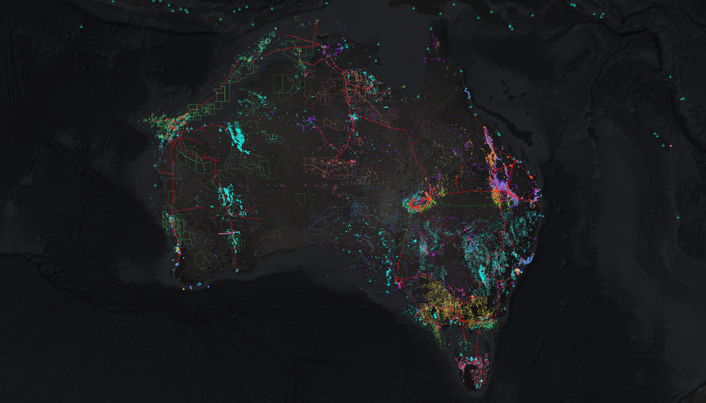

> _"Structured data is the foundation of trustworthy AI."_
> 
> --- Jensen Huang at the 2026 NVIDIA GTC keynote

I've written [before](https://nick-dorsch.github.io/blog/posts/spreadsheets/) about the
problem of relying on spreadsheets for storing and processing important data. Many
smaller companies in this industry fall into this trap because of the large investment
in cloud infrastructure, data and software professionals and maintenance burden that
comes with the territory. The benefits are known, though perhaps a little unclear, but
the pathway to reach this level of capability causes hesitation. 

With all the recent buzz around agentic AI systems, the need for a system of record that
can guarantee access to accurate and current business data has become clearer than ever
before.

The distributed nightmare of spreadsheets scattered around sharepoint, surrounded by
poorly integrated systems for handling workloads like GIS, hydrocarbon accounting and
business intelligence reporting, cause humans and AI alike massive friction in using
data effectively.

I've been building a bootstrapping kit that allows a company to go from zero to _very
high capability_ in a matter of days, instead of months to years. The vision is to
initialize the system of record and an entire automated platform around it with small
set of configurations and a single command.

It is not the kind of thing that needs a name, because it will likely be rebranded for
each client, but I'm calling the bootstrapper **Databasin**.



## What is Databasin?

Databasin is a data platform bootstrapping system that brings together a multi-purpose
database built on PostgreSQL, a detailed data schema, a configurable data governance
model, multiple services streaming useful public sources of data, and a presentation
layer for GIS and BI applications.

### Out of the Box

With minor configuration and a single command, you get

1. The Databasin database
2. A full suite of GIS layers over your operating regions, including pipelines and
   tenements boundaries
3. Historical commodity prices, updated daily
4. Live vessel tracking (tankers, cargo ships), globally or over your specific area of
   interest
5. Supporting technical datasets like eustatic sea level curves and canonical geological
   time periods
6. A hydrocarbon accounting platform to take measured data through to allocated,
   reportable production
7. A well log LAS file pipeline for generating detailed sand statistics in a structured
   format, grouped by interval based on tops, ready for downstream technical workflows
8. Core domain logic for computing key business metrics
9. A semantic layer of clean data ready for use directly in business intelligence tools
   (PowerBI, Tableau, etc) as well as spreadsheets
10. An observability system for monitoring data pipelines and platform health
11. Role based access control for data security and governance.

Databasin is the foundation that provides all of this functionality, but everything is
configurable to particular business requirements on a case by case basis.. 

### Value from day one

Migration to a new system inevitably takes time as legacy systems are moonlit in favor
of database centred operations... but Databasin is built to deliver value from day one,
getting more and more valuable as it is integrated into the business, eventually
becoming the canonical system of record.

```{mermaid}
sequenceDiagram
    autonumber
    participant Ops as Business Operations
    participant Legacy as Existing Systems
    participant DB as Databasin
    participant LDI as LD Informatics

    LDI->>Ops: Assess current systems and define Day 1 scope
    Ops->>Legacy: Continue existing workflows
    Legacy-->>Ops: Ongoing outputs

    LDI->>DB: Deploy starter kit + configure platform
    DB-->>Ops: Day 1 GIS and supporting datasets 

    Ops->>LDI: Define client-specific requirements
    LDI->>DB: Build client-specific functionality
    DB-->>Ops: Expanded analytics and operational workflows

    LDI->>Ops: Validate parity/enhancement vs legacy outputs
    Ops->>Legacy: Sunset legacy workflows
    Ops->>DB: Databasin becomes system of record
    DB-->>Ops: Existing + enhanced analytics and reporting
    DB->>LDI: Platform health observability
    LDI-->>DB: Ongoing support and iterative improvements
```

## What makes this work?

Databasin is built around a foundation of opinionated architecture, supported by
configurable and extensible services. The functionality that PostgreSQL provides makes
it a clear choice for the system, as it provides all the benefits of relational data
modelling with best-in-class GIS support and extensibility.

### Architecture Diagram

```{mermaid}
flowchart BT
    public_gis_elt[Public GIS]
    market_data_etl[Markets]
    aisstream_tanker_tracker[Vessel Tracker]
    las_processor[LAS Processor]
    pi[Pi Connector]

    postgres[(PostgreSQL)]
    security[Data Security Model]
    presentation[Presentation Layer]

    bi[BI Tools]
    gis[GIS Tools]
    excel[Spreadsheets]
    petex[Petex]
    analytics[Advanced Analytics]

    security --> analytics

    public_gis_elt --> postgres
    market_data_etl --> postgres
    aisstream_tanker_tracker --> postgres
    las_processor --> postgres
    pi --> postgres

    postgres --> security ---> presentation
    presentation --> excel
    presentation --> bi
    presentation --> gis
    presentation --> petex
```

## Deployment Pattern

The intention is for Databasin to be deployed on company cloud infrastructure, whether
that is AWS or Azure. The use of the Infrastructure as Code (IaC) solution Terraform
means the deployment pattern is rapid and repeatable.

The operating standard is that no "Click Ops" is ever used (configuring cloud services
manually using provider web interfaces). Everything is version controlled, auditable and
repeatable as code.

A dedicated secure subnet, where all server provisioning and inter-service networking is
preconfigured out of the box, makes deployment highly efficient.

## Example Functionality

Here are a few example workflows that Databasin comes with out of the box.

### Hydrocarbon accounting 

The [enso](https://nick-dorsch.github.io/blog/posts/enso/) graph-based production
allocation and accounting system is fully ported into Databasin, allowing the platform
to serve as the canonical source of meter to reportable production data if the client
desires the system to perform that workload. 

If an existing system is already set up, Databasin can integrate with it instead,
providing an integrated source-of-record while not performing the allocation workload
internally.

### Automated sand summary statistics

The LAS pipeline that Databasin supports allows for detailed summary statistics to be
generated dynamically. 

Sand intervals (along with coal, carbonate, shale, or whatever other lithological flags
are used) are loaded into the database as "porous intervals", which have a top and base
depth, a location, and summary statistics of key log derived properties.

These are generated directly by the pipeline from LAS files, allowing hundreds to
thousands of logs to be processed in minutes, storing canonical data cross referenced to
wellbores at the individual flag level.

Combining this with stratigraphic or chronostratigraphic intervals picked at wellbores
allows for summary statistics by interval and lithology, like the count of porous
intervals, the total thickness across them, and thickness weighted average properties,
to be calculated dynamically by a database view and served to any end point for
analysis. 

This includes geospatial analysis, since the interval picks are geolocated, allowing for
geostatistical workflows to consume perfectly formatted and preprocessed data, with zero
data wrangling required.

If matching to chronostratigraphic intervals, the database also provides mean sea level
estimates based on canonical sea level curves.

It also allows every porous interval to be cross referenced to wellbore perforations,
giving subsurface workers a detailed view of perforated intervals and the reservoir
properties evaluated across them.

### Automated prospect screening

Prospect polygons can draw from the porous interval database, utilizing inverse distance
weighted averages to provide plausible rock property parameters. Combined with the area
of the polygon and some depth based formation volume factor calculations, screening
volumetrics can be run to provide a quick-look prospect ranking system. This enables
hundreds of prospects to be evaluated automatically, allowing for high grading of
opportunities for further study. As a dynamically calculated layer, these metrics will
be available for all prospect polygons ingested into the database, with no additional
work required.

### Live vessel tracking + vector and projected positions

The database stores live vessel positions, which are frequently updated with a dedicated
service. This information allows for plotting vessel positions geographically, but also
vector stream diagrams indicating speed and bearing, as well as projected position
indicators that dynamically estimate current locations based on the last known speed and
bearing.


Ports are also geolocated. The intention here is that clients can specify key vessels
and ports to allow for dynamic tracking and time/distance to final destination
calculations.

### Production bubble maps

Production data coexisting with GIS capability means production metrics can be reported
in intuitive, geospatial formats like bubble maps, 3D geographic bar charts, heat maps
etc.

### BI reporting

The presentation layer that Databasin provides means that semantic models are trivial to
import into business intelligence tools, allowing for flexible dashboarding and
reporting across the rich domain model that the platform manages.

All of these workflows grow in usefulness as more data is ingested into the system.
