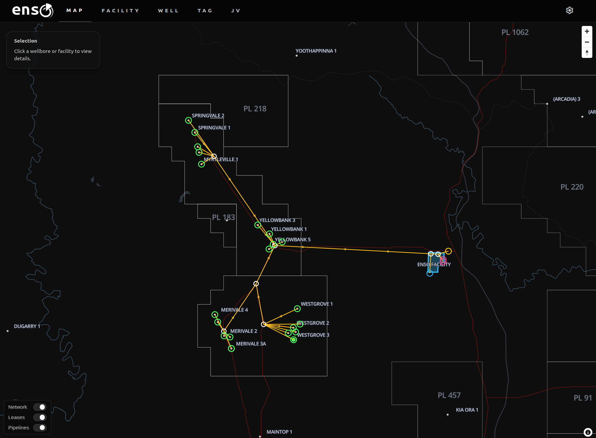

In my [previous post](https://nick-dorsch.github.io/blog/posts/spreadsheets/) I waxed
lyrical/incoherently ranted about the benefits of relational databases and good data
modelling, comparing it to the pains I've experienced doing data work in spreadsheets.

It is hard to fully communicate the benefits of this kind of work to someone outside of
the data engineering space, and I know this because earlier in my career I was totally
oblivious to it as well. 

I had my `DataFrame` and I could do whatever I wanted with it with `pandas`, so why
would I have cared about the database? It just stores the data, right? The magic happens
downstream in code. (Substitute in spreadsheets as you like.)


Because a database isn't a digital filing cabinet -- a database is a declarative
interface to a highly optimized and parallelized computational engine that is the
culmination of half a century of research. Your spreadsheet isn't a replacement. Neither
is your Python code.

The things I have built in the past 2 years would be a completely impractical mess
without their heavy reliance on the wide range of functionality that relational
databases provide out of the box.

At LD Informatics we've taken a lot of my learnings while working as an employee and
made them concrete in an oil and gas data platform called **enso**. I think it is a
strong showcase of both databases generally, as well as the kind of services and
capabilities we can provide to the industry.

# What is enso?


[Enso](https://ld-informatics.com/enso/) is a GIS enabled data management platform for
oil and gas operators that integrates with historian metering systems. It does not just
store this data, but doubles as a computational engine for workloads like production
allocation, hydrocarbon accounting and JV management. 

It is designed from the ground up to radically streamline the calculations of a wide
range of important quantities and metrics by vertically integrating data management
through the upstream production lifecycle, while providing a GIS interface for efficient
data exploration, visualization and network management.

Enso is both a product and a technical showcase.

It is a product in the sense that it can be packaged up and sold with a Platform as a
Service model, similar to competing offerings on the market. 

It is a showcase in the sense that it is a repeatable set of technologies and practices
that can be implemented internally at companies that want to better use their data,
while customizing and controlling their process. 

The biggest pain points for off-the-shelf solutions are awkwardly fitting them into
existing processes, and failing to integrate them effectively. Internal deployments
allow the solution to be both customized to internal requirements, and also integrated
into other systems so that data can flow between them automatically. 

This integration piece is crucial. The magic technology solving all your data problems is
significantly less useful if the rest of your company still needs someone babysitting
spreadsheets to serve data downstream. You need information pipelines, not hand-pumps.

## Who is enso for?

The pattern I have noticed during my career is that data is often underutilized in this
industry, regardless of company size.

By that I mean large companies certainly have data infrastructure, but it is often
underutilized due to the inability to integrate simple data storage demands with domain
specific workflow automations that maximize its value. There is a "skill overlap gap"
between data and technical. 

This is the _"we mostly ignore the database"_ problem.

Smaller companies may not even have a database, because the overhead of setting up a
data team and cloud infrastructure is too difficult to justify given a lean operating
model. There are simply too many other concerns being juggled to carve out the time and
budget for it, so engineers make do with the tools they are familiar with.

This is the _"excel is our database"_ problem.

Enso, and LD Informatics more generally, exist to help solve these problems, by

1. Deploying internal solutions for companies that want control of cloud infrastructure
   and data 
2. Providing a platform as a service model for companies that are not ready for internal
   cloud infrastructure management

So, what can enso actually do?

# Enso's capabilities

Enso can perform many oil and gas data workloads. Because so much of the business is
downstream of operational metering, which enso manages, the platform provides a strong
foundation for a vertically integrated system of data pipelines to serve different
departments of the business.

Some examples include:

## Hydrocarbon accounting

Enso uses a spatiotemporal graph (explored in a bit more detail in [this
section](#why-graphs)) to efficiently perform production allocation. It connects to data
historian systems that manage high frequency meter data and ingests daily snapshots for
production accounting purposes. Tag data is associated with a node in the network,
placing measurements in their network and spatial context.

All "terminal nodes" (fiscal meters, gas flaring, water disposal, etc) are dynamically
allocated back to their upstream connected wellbores. This means oil, gas and water
production streams can be contextualized to their particular node (oil and gas sales,
for example) or to wellbores (oil, gas and water streams are the sum of allocated
production across all connected terminal nodes). 

This means wellbore production accounting also includes any gas flaring, injection,
water disposal etc, with no additional complexity required. The graph handles the
relationships, and the database engine handles the allocation. As the network grows, the
only overhead is keeping it up to date (and enso provides interactive tooling to do
this), the calculation workloads are automated.


Because the data model is dynamic, it also handles error correction seamlessly. If bad
data enters the system, it can be corrected with all downstream data products updated
along with it. A full audit trail is kept for all corrections made and why. The system
also provides diagnostics to flag potentially erroneous measurements, to prevent a
"needle in the haystack" problem when hunting through large quantities of tag data.

Building on production allocation, the next natural workload to take on is calculated
Joint Venture shares of it.

## JV management

By themselves, Joint Venture partnerships are relatively straight-forward, but they
change, and you might be managing many of them at any given time. Which wells fall under
which partnership? Has that partnership been updated recently? Who is managing the
spreadsheet that maps them to the production data and does all the calculations, again?


Unifying the data model makes all of this straight forward. If the JV partnership data
is up to date, **so is everything else**. JV shares of allocated production are all
generated dynamically on demand, and all respect the historical changes in network
topology, JV partner members and their shares, and everything else in the data model.
Correcting faulty meter data from six months ago does not cause cascading data
invalidation, the correction simply flows downstream to everything else.

## BI and GIS integration

The technology stack enso is built on facilitates integration with other tools. Deployed
internally, the enso database can be connected to Geographic Information System (GIS)
software suites like QGIS or ArcGIS. The integration of GIS data and a rich domain model
mean that data can be enriched with business context and displayed in GIS software
seamlessly. Business Intelligence (BI) suites like PowerBI or Tableau offer similar
integrations. 

If a heatmap of last year's water production, grouped by lease boundaries is what you
need, that is a short SQL query away. If you want to model the distance between
wellbores and available fiscal meters to look for network optimization opportunities,
that data can be delivered directly into BI tools for interactive visualization. It all
comes from the same underlying engine.

The key theme is a rich, integrated, queryable data model.

# Enso's future

Building on the foundation we have, enso is highly extensible. Some examples in our
development pipeline include:

## Reservoir management

The production network graph can be extended downhole to connect wellbore completions
and reservoirs. Well logs can be ingested into the database via a "flag pivot", storing
every individual sand/pay flag with statistical summaries of each log over the interval.
Combined with stratigraphic top storage, sand summaries can be dynamically calculated on
demand. 

Wiring sand intersections to pressure compartments will provide a highly detailed
subsurface field model, with all metered data stored in the same system. Cross
referencing with pressure points, core plugs and other supporting datasets, will make
bringing together many disparate datasets, organized by zone, trivial.

## Production planning

Production in enso is allocated to nodes in the network, and future production
(forecasts) can be treated in the same way. Production forecasts and scenario modelling
can be visualized, managed and audited in the same system that manages GIS layers and
historical production data. This naturally lends itself to comparisons between predicted
and actual production.


## Commercial integrations

Querying price data either by API or integrating with internal price sources/price decks
means historical and forecasted revenue estimates can be generated by the system
seamlessly. It also means that measures of production efficiency and production losses
can be quantified as lost revenue, to put outages and disruptions in their commercial
context.

## PETEX and other software integrations

Storing network topology and metered data in the same system makes enso a perfect fit
for rapid configuration of industry standard integrated modelling solutions like Petex's
PROSPER, MBAL and GAP, and was another primary motivation for the graph based design.
I write more about this [here](#integrated-network-modelling).

## AI Integrations

It is not a good idea to ask a fundamentally probabilistic LLM agent to do accounting
for you. Deterministic systems built for domains where accuracy is paramount should stay
deterministic. 

That being said, incorporating AI agents into user service level elements of software is
an area of increasing importance. Our plans for enso are to provide agent driven (read
only) database access, so that data reports can be generated in response to natural
language prompts. This means no SQL skills would be required to get answers to detailed
data questions. 

Combine this with tools that allow the AI to build visualizations, and a "generative UI"
style interface becomes possible, where users can ask for dashboards built to answer
specific queries to be generated on the fly.

There is also the fundamental piece of programmatic access for agents (or other
programs) to facilitate information flows between enso and other internal systems.

I am building with a near term future in mind where much of software interaction is
occurring via agentic processes, and less by UIs built for humans. With the way things
are moving, modern software needs to account for both human and agent ergonomics.

# How does enso work?

The three design pillars that make enso possible are:

1. **Database Centric Architecture** - computations primarily occur in the database
   engine, not in external services
2. **Spatiotemporal Graphs** - because production systems form an evolving,
   interconnected network laid out in space
3. **GIS** - because production systems (and oil and gas assets in general) have a
   geographic footprint, and maps are the most intuitive way of interfacing with them

More concretely, the production network is encoded as a Directed Acyclic Graph (DAG),
where fluid flows follow the edge direction between nodes. Each node in that graph is
geolocated, allowing you to place the network in its geographic context on a map. The
network evolves as wells are connected, taken offline, or production is rerouted. The
historical network topology is stored.

The wider relational data model is joined to the nodes to allow for flexible querying
between the graph and other key entities, which places all of them in their network
context seamlessly.

## Why graphs?

Fundamentally, [graphs](https://en.wikipedia.org/wiki/Graph_(discrete_mathematics)) are
the optimal data modelling choice for a platform like enso, because they map most
naturally to the problem space. Production networks are well represented by graphs, and
that coherence leads to more elegant solutions for many data workloads.

For example:

### Production Allocation

Production allocation requires that high accuracy metering is allocated back to
individual wellbores, such that their production is consistent with the downstream
measurement. 

It is a fundamental requirement for field modelling as it allows reservoir engineers to
work with high accuracy estimates for how much each well is producing, and from which
reservoirs in the subsurface production is coming from. 

There are various ways to do it, but fundamentally the process requires an estimate of
each wellbore's **"production potential"** on a given day. The calculation of production
potential in turn (regardless of the particular method used), requires:

1. Identification of the set of wellbores connected to the downstream meter being
   allocated to
2. A comparative measure, normalized across that set, to calculate the allocation factor
   of each wellbore (commonly individual well meters, or the most recent production test
for each well)
3. Multiplication of the downstream meter value by the allocation factor for each
   wellbore

In principle, a very simple procedure, but as the network grows an increasingly
difficult one.

For example, consider the following simple network:

```{mermaid}
flowchart TD
    W1((Well A)) --> MAN[Manifold]
    W2((Well B)) --> MAN
    W3((Well C)) --> MAN
    MAN --> COMP[Compressor]
    COMP --> FM((Fiscal Meter))
```

Allocation on a given day could be performed by:

#### Spreadsheet

1. Get wellbore meter data
2. **Use a VLOOKUP** to find the fiscal meter each well is connected to
3. Calculate allocated production

#### Database foreign keys

1. Get the wellbore meter data
2. **JOIN on the fiscal meter** based on a direct wellbore -> fiscal meter foreign key
3. Calculate allocated production

#### Graph

1. Get the wellbore meter data
2. **Traverse the graph** to find each well's downstream fiscal meter
3. Calculate allocated production

With such a simple network a spreadsheet works fine. The graph implementation requires
additional traversal logic, making it overkill for this example. But real production
networks are much more complicated:

```{mermaid}
flowchart TD
    W1((Oil A)) --> M1[Manifold A]
    W2((Oil B)) --> M1
    W3((Gas A)) ---> M2[Manifold B]
    W4((Gas B)) ---> M2
    W5((Gas C)) ---> M2
    M1 --> SEP3[3-Phase Separator]
    M2 --> SEP2[2-Phase Separator]
    SEP3 ---> COMP[Compressor]
    SEP2 --> COMP
    COMP --> FLR((Gas Flare))
    COMP --> FMGAS((Gas Fiscal Meter))
    COMP --> FGC((Gas Fuel))
    SEP3 ---> WD((Water Disposal))
    SEP2 ---> WD((Water Disposal))
    SEP3 ---> PUMP[Export Pump]
    PUMP --> FMOIL((Oil Fiscal Meter))
    PUMP --> FGP((Gas Fuel))
```

This is where the graph representation of the network clearly pulls ahead. There are now
**6 terminal nodes** (the oil fiscal meter, gas fiscal meter, gas flare, water
disposal, and two fuel gas nodes) that all need to be accounted for to properly
calculate the allocated production for each well, instead of the single fiscal meter in
the previous example.

For example, for a given well the gas production is not just the gas allocated from the
fiscal gas node, but the sum of allocated flare gas, fuel gas and sales gas. Headache!

The graph traversal logic resolves all of these relationships for us:

```{mermaid}
flowchart TD
    FLR((Gas Flare))
    FMGAS((Gas Fiscal Meter))
    WD((Water Disposal))
    FMOIL((Oil Fiscal Meter))
    FGC((Gas Fuel))
    FGP((Gas Fuel))

    W1((Oil A)) --> FMOIL
    W1 --> FMGAS
    W1 ----> FGC
    W1 ----> FGP
    W1 ---> WD
    W1 ----> FLR

    W2((Oil B)) --> FMOIL
    W2 --> FMGAS
    W2 ----> FGC
    W2 ----> FGP
    W2 ---> WD
    W2 ----> FLR

    W3((Gas A)) --> FMGAS
    W3 ----> FGC
    W3 ---> WD
    W3 ----> FLR

    W4((Gas B)) --> FMGAS
    W4 ----> FGC
    W4 ---> WD
    W4 ----> FLR

    W5((Gas C)) --> FMGAS
    W5 ----> FGC
    W5 ---> WD
    W5 ----> FLR
```

This looks like a nightmare, but that's the point! Encoding all of these relationships
with VLOOKUPs or foreign keys quickly creates a mess. 

The allocation math is easy! The **relationships** are the difficult part. Define the
graph and let it discover the relationships for you.

The allocation algorithm just repeats the same logic over each set created dynamically
by the graph. Water allocation occurs over the full set, oil allocation occurs over the
oil set, and so on. Databases are built for these kinds of set-based operations.

### Networks changes

Imagine a manifold is rerouted to a different facility and fiscal metering end point,
maybe as a result of a production optimization effort. 

How would you handle this?

#### Spreadsheet

1. Find all wells that are affected by the network change
2. Remap all of those wells to the correct downstream meter via updates to VLOOKUPs
3. Maintain the history of production network changes, so that data before the change
   and data after remain correct in the event things need to be rerun retrospectively
(or just hope that never happens)

#### Enso

1. Update an 'edge' to reroute the network

That's it. All the well groupings, network change history and production allocation will
keep working just as before. And not just for sales points, by the way, the same
allocation logic is being updated for all flaring, fuel and water disposal accounting,
as well.

The network change history is retained and fully auditable, and all production
accounting is reproducible throughout the lifecycle of the asset.

### Integrated Network Modelling

Even I'm not crazy enough to advocate GAP style network modelling being done in a
database. There is a fairly clear dividing line between where database logic ends and
application logic begins, and complex optimization problems fall very clearly on the
application side. 

That being said... How are you getting all that data into your GAP model? In my
experience it is a large piece of work to even configure the thing to run. Doing it
manually by hunting through spreadsheets and finding good representative data across
your network would be a complete nightmare, and make iterating on network modelling, or
updating the model at a decent cadence, basically impossible.

So here's an idea... Your data platform does it for you. Enso stores the network
topology and all metered data (at daily resolution), which makes a database connector to
GAP models via OpenServer a largely automatic process.

```{mermaid}
flowchart TD
    ENSO[(enso)]
    OPENSERVER[OpenServer]
    GAP[GAP]
    PROSPER[PROSPER]
    APP[Controller]
    FORECAST[Forecasts]

    ENSO <--> APP
    APP --> OPENSERVER
    OPENSERVER --> PROSPER
    PROSPER --> GAP
    OPENSERVER --> GAP
    GAP --> FORECAST
    FORECAST --> ENSO
```

A thin application layer acts as a controller that translates data outputs from the
database to OpenServer `DoSet` calls, which configure PROSPER and GAP models. The
operator just chooses the representative date they want the data to come from. 

If the selection process requires more nuance, the best place to encode it is in a
database function. A set of boolean flags can help filter out unwanted data points, and
the database can find more appropriate data as close as it can to the target date, for
example.

This is all facilitated by enso's domain coherent approach to data modelling. The system
knows the production network, and it organizes all data to support it. In data nerd
talk, the impedence boundary between the data and downstream application workloads is
minimized. In normal person talk -- no more spreadsheet nightmares, and dramatically
faster cycle times for network modelling.

## Why GIS?

Hopefully the benefits of the graph are clear, and quite manageable for smaller assets,
but if your company manages a large asset, isn't that network going to become a
nightmare to maintain?

... Yes!

Imagine you have thousands of wells producing, and new wells coming online every other
day. An abstract floating graph with thousands of nodes will quickly become impossible
to navigate.

So put it on a map.



It's that simple. The whole production network is laid out logically in the physical
world, so represent it in the digital world the same way. Now, managing the network is
about as complicated as choosing a restaurant for dinner on Google Maps.

I'm admittedly a bit of a GIS fanatic, but for good reason. Maps are one of the most
intuitive data interfaces we have. Subsurface workers live and breathe 2D and 3D GIS
canvases, but something gets lost as you move to surface engineering, for some reason.
The same GIS awareness of assets should be shared across technical teams.

You can't present these kinds of data effectively in a spreadsheet. Walls of numbers
will give your team eye-strain, not operational excellence.

Place everything in its geographic context, and onboarding a new team member is more
_"take a look at the map"_, and less _"lets find a time next week to go through the
master spreadsheet, please don't open it unsupervised before then"_.

## The Everything Data Bagel 

Enso is built on `PostgreSQL` and `PostGIS`. The extensibility that `PostgreSQL`
supports makes it an extremely flexible and powerful data modelling playground.

Enso is leveraging it for many purposes, including:

1. Relational data storage and querying
2. GIS
3. Graph based spatiotemporal network modelling
4. The production allocation engine (along with almost all data calculations downstream
   of it)
5. Many data aggregation tasks used in the frontend (cards, chart data preparation etc)
6. Security guarantees via RLS policies

This may sound like too much for a single service to handle, but keep in mind that we
are talking about a single tenant data platform serving maybe 1000 users at most, this is
all completely manageable by a single database server.

Although graph traversal in SQL requires the use of recursive CTEs, which are quite
verbose, being able to integrate GIS, graphs and relational data modelling in a single
system more than makes up for it. The main graph traversal logic is stored as views, so
in practice it adds very little complexity for us developing it and operators using it.

Importantly, the system does not _lose_ anything by incorporating geospatial, it is really
all upside from a platform capability perspective.

The ability to serve GeoJSON from the database directly to GIS software or your custom
frontend with queries as simple as this:

```SQL
SELECT json_build_object(
  -- Query level metadata
  'type', 'FeatureCollection',
  'count', COUNT(e.*),

  -- List of features
  'features',
  jsonb_agg(
    jsonb_build_object(
      'type', 'Feature',

      -- create lines between the nodes each edge is connected to
      'geometry', ST_AsGeoJSON(n1.geom, n2.geom))::jsonb,

      -- edge metadata
      'properties', jsonb_build_object(
        'edge_webid', e.webid,
        'from_node_webid', n1.webid,
        'to_node_webid', n2.webid,
        'from_node_name', n1.name,
        'to_node_name', n2.name,
      )
    )
    ),
  )
)
FROM public.edges AS e
JOIN public.nodes AS n1 ON n1.id = e.from_node_id
JOIN public.nodes AS n2 ON n2.id = e.to_node_id
```

... it's enough to turn you into a fanatic.

Oh, we need a bounding box filter? Make the query a function, add a simple bounding box
CTE and join on it with `ST_Intersects()`. It's just SQL joins! But in SPACE?! I mean,
are you kidding?


And with that in mind, remember that the rest of the relational data model is sitting
there, waiting for whatever arbitrary geospatial computation or visualization you could
ever want. 

Quarterly cumulative production bubble maps at facilities? Done. 

Allocation factor heatmaps at wells for quick visual diagnosis? No problem.

Inverse distance weighted reservoir properties cross referenced to stratigraphic
interval, aggregated across prospect polygons simultaneously calculating screening
volumetrics for 120 leads, combined with distance to nearest tieback point and turned
into a lease by lease potential heat map?

I WON'T SAY NO PROBLEM.

BUT I WILL SAY I'VE DONE IT.

`PostGIS` is an unbelievably powerful tool.

All coming direct from your database to your GIS interface with a single SQL query. 


# Our plans

Unhinged rants aside, we are very proud of what we've built with enso. It is deployment
ready and we are continuing to enhance it. 

We are ready to work with companies to deploy our solutions. If you read this, and some
of the pain points resonated with your experiences at work, and you can see the
potential I am writing about, don't hesitate to contact us.
