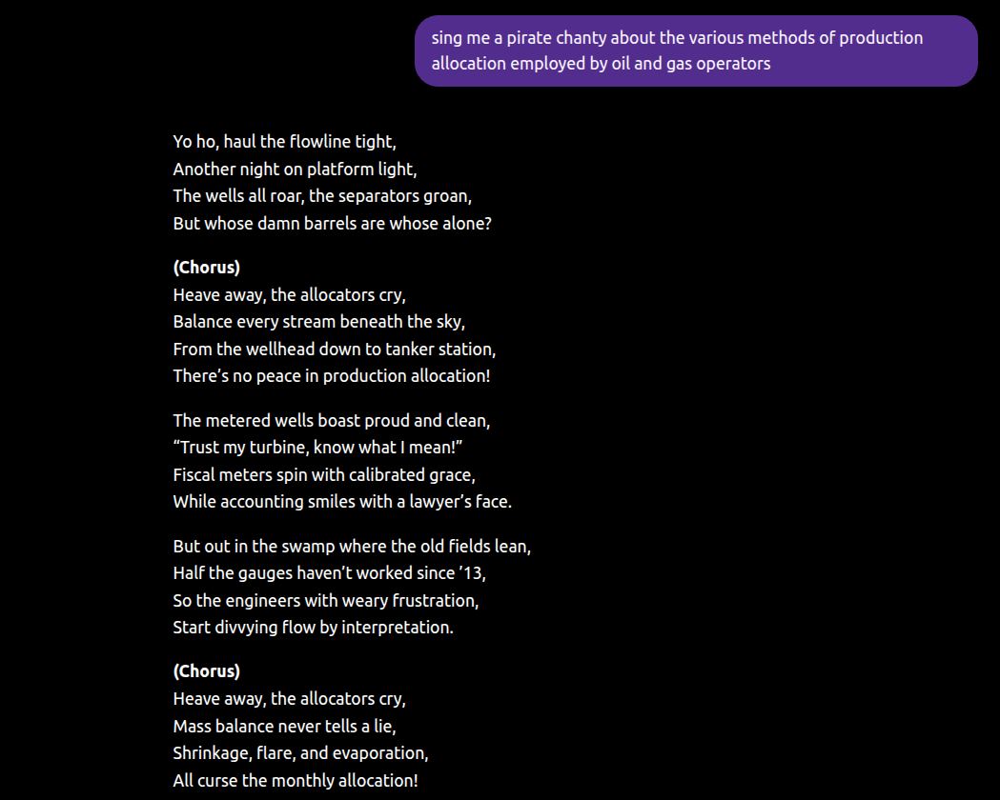

> **Inform**, from the Latin _informare_: to give form to the mind.
>
> **-atics**: use technology to do it quickly and automatically. 
>
> **Informatics**: use technology to distribute accurate information to the brains of
> decision makers, quickly and automatically.

I decided to name my company _LD Informatics_, or just LDI. Why did I do that? What a
weird name... What a weird guy... I know.

Before the company, _informatics_ was a term, loosely defined, that had been bouncing
around in my brain for the past few years. It is a blurry picture of an overarching
philosophy I have about data in business, which connects my various
obsessions---domain-driven data modelling, software engineering, Bayesian inference, and
uncertainty quantification---into a cohesive whole. In my head, these things fall under
the umbrella of _informatics_.

And yes, it sounds nerdy and pretentious and a bit sci-fi, and creates adjacency with
super technical fields like bioinformatics and geoinformatics, but give a man his word.


I can learn about a client's systems, and might think to myself that this company has
"good" or "bad" informatics. I think that means the term compresses a bunch of useful
concepts together, so maybe it's worth exploring what I'm talking about.

## Key points for the impatient

- Data has no inherent worth. Its value is derived from its role in improving decision
quality
- What I'm calling _informatics_ is the discipline of turning data into decision-grade
information, automatically, including all the scaffolding that makes that possible
- Decision-grade information might be probabilistic analyses, or just point-estimate
metrics, depending on what is being deliberated over and what is at stake
- Informatics integrates systems, logic, uncertainty and technical communication over
the vertical stack of data flowing through a business
- Most companies have "leaky" informatics, due to manual handoffs, poorly integrated
tooling, and spreadsheet-dominated data workflows
- This makes data work inefficient, for human and AI analysts
- Companies with good informatics will get the most leverage out of agentic AI

The rest of this post features me trying to explain what I mean in more detail.

## Data is worthless

Data is abundant, and---robbed of its context---worthless. 

Even _in_ its context, without understanding and integrating it into decision making, it
is still worthless. You could spend millions on data gathering and fail to use it to
make the right call, and your money would have been wasted. Maybe it kept some nerds
like me busy for a while, and I'll take it, but the money was still wasted, the data
didn't ultimately serve your goals.

The data isn't the point. I don't actually care about data. That might seem like a weird
thing to say, coming from someone who spends all his time buried in it, but it's true.

I care very much about _information_. I think that is what we all actually care about.
We use information to understand _what is going on_ in a messy and complicated
operation, and our understanding of that helps us make better decisions. The value of
data is inextricably tied to the quality of decision making it enables.

But isn't data just information? What's the difference?

## Counting sand grains

Let's say, for some reason, I'm interested in the average size of sand grains at a local
beach. The data is each individual measurement of a sand grain. 

How many grains do I measure? How valuable is my data gathering process? Well, the
_uncertainty reduction_ I get from each new grain is falling off at a rate of one over
the square root of the count of grains I've measured so far... and the question of when
to stop depends on my goals.[^weather]


There is a _fact_ about the true average grain size on that beach---we could spend
millions of dollars excavating and measuring every grain, and in 10 years arrive at the
precise value to 60 decimal places---but we don't care enough to do it.[^council]

The data only serves us insofar as it provides the information we need, at the level of
confidence we need. Maybe we are world-leading sand aficionados and we've been hired by
a firm for a large sum of money to demonstrate that the local beach has larger sand
grains than the next beach along the coast. If after 1000 grains we still can't be sure,
we'll keep measuring grains until we are.

Stupid example? Maybe. But how many business contexts involve questions about
information gathering and its value? 

When do we stop counting sand grains? How do we know when to stop?

Or, translated to a business context:

What data gathering processes are we paying for? 

Are we using them effectively? 

And, maybe a useful mental refrain:

_Is our data paying rent?_

My career experience so far has shown me that the answer is, often, no. 

I'm building a company to help other companies do this better, and (in conversations
with myself, or others if I have a third glass of wine) I call the endeavour
_informatics_.

## Real business problems

Real business problems are far more multifaceted and complex than a research question
about beach sand. 

The "informatics" of a business might require the integration of hundreds of different
data streams, propagated through complex logic, aggregated to the resolution that best
serves the decision at hand, and delivered to just the right people at just the right
time. 

It might require jumping out of the core data system and into highly sophisticated
software platforms for specialized technical work---but the information that comes out
of them should be represented back in the core system, automatically, or your
informatics will sprout a leak.

Informatics is the engineering challenge of integrating a vertical stack of data
streams---transforming them, analyzing them, visualizing them---all in service of
injecting the right information into the right brains at the right time, to _hopefully_
increase the probability of good decisions being made.

Informatics is cloud infrastructure, it's data engineering, data analysis, data science,
it's business "semantics" and "ontology", it's database design and machine learning and
Bayesian statistics, it's pretty plots and dashboards, it's GIS, it's risk management.
It's all of those things, deployed in service of that objective: Help a business make
better decisions. 

Informatics requires a lot of different skills. In an unfamiliar industry, it also
requires a lot of ground work in even understanding the shape of the problem.
Consultants who don't understand your business can disguise that reality by calling it
_semantics_ or _ontology_, but that is consultant speak for "we don't get it, and we're
going to need months of meetings with your people before we can even start". Maybe I'm
wrong, maybe I'm cynical, but that's what I have observed in my career so far.


I'm starting my informatics career focussed on oil and gas, because I've already done
most of that groundwork---I know many of these problems back to front, and am packaging
solutions in [DataBasin](https://nick-dorsch.github.io/blog/posts/databasin/)---but my
goals extend beyond my native industry. Different industries, different problem
topologies, same guiding principles.

The information must flow. 

Make the data pay rent.

## Are we uncertain? Do we care?

### When we care

I love Bayesian methods, but I don't need them to estimate the average grain size on a
beach, I'm happy with basic arithmetic. 

... But if someone puts a gun to my head, demands an estimate, and only lets me count 20
grains? Well, that changes things.[^grains-guy]

Now my uncertainty quantification requirements have gone from, at best, an opportunity
to teach something cool about statistics, to a question of life or death.

I know it's still a dumb example. 

My point is that uncertainty is interesting to us insofar as we are exposed to its
consequences. 

Sometimes, business decisions involve putting hundreds of millions of dollars on the
line. If I had to boil down why the oil and gas industry is so interesting to me, it's
that somehow people convince themselves, despite _devastating_ levels of uncertainty, to
spend that money, knowing full well there is a good chance it will return no value.

But when you are gambling with a hundred million bucks, your uncertainty about _what
will happen_ is, let's say... of material interest to stakeholders.

So in that context, throw the bloody supercomputer at the problem, pay your best and
brightest to do a great job of, ultimately, _quantifying the uncertainty_, so that
decision makers have the right information in their heads when they say _"yes"_ or
_"no"_ or _"that one, not this one"_. 

Good decision making under that level of uncertainty requires that information. The
sufficient information is not a number, it is a distribution. That is the fit for
purpose informatic endpoint for that decision. 

Are you going to tell me your managers don't understand probability distributions? I
don't believe you, but fine. That just means the informatics of the problem includes
_making distributions understandable to everyone who needs to understand them_. That is
what good visualizations and good technical communication are for. That is part of
informatics.

#### For example:

Two opportunities cross your desk and you have to pick one. 

Option A or Option B? 

You choose, _business man!_

```{python}
import altair as alt
import numpy as np
import pandas as pd

from src.plotting import apply_lex_altair_theme

apply_lex_altair_theme()

option_means = {"Option A": 300, "Option B": 400}
colors = ["#ddb06d", "#c78d3b"]

x_min, x_max = -200, 1000
x = np.linspace(x_min, x_max, 800)

def normal_pdf(x: np.ndarray, mu: float, sigma: float) -> np.ndarray:
    return (1 / (sigma * np.sqrt(2 * np.pi))) * np.exp(-0.5 * ((x - mu) / sigma) ** 2)

lines_df = pd.DataFrame(
    {
        "option": ["Option A", "Option B"],
        "value": [option_means["Option A"], option_means["Option B"]],
    }
)

alt.Chart(lines_df).mark_rule(strokeWidth=4).encode(
    x=alt.X("value:Q", title="Value ($M)", scale=alt.Scale(domain=[x_min, x_max])),
    color=alt.Color("option:N", scale=alt.Scale(range=colors), legend=alt.Legend(title=None)),
).properties(width="container", height=300)
```

$300m for A, $400m for B. 

B is higher. Choose B. Easy money.

Ok, what about now?

```{python}
std_equal = 50

df_equal = pd.concat(
    [
        pd.DataFrame(
            {
                "value": x,
                "pdf": normal_pdf(x, mu, std_equal),
                "option": option,
            }
        )
        for option, mu in option_means.items()
    ],
    ignore_index=True,
)

alt.Chart(df_equal).mark_line(strokeWidth=3).encode(
    x=alt.X("value:Q", title="Value ($M)", scale=alt.Scale(domain=[x_min, x_max])),
    y=alt.Y(
        "pdf:Q",
        title=None,
        axis=alt.Axis(labels=False, ticks=False, domain=False, grid=False),
    ),
    color=alt.Color("option:N", scale=alt.Scale(range=colors), legend=alt.Legend(title=None)),
).properties(width="container", height=300)
```

Well, there's some overlap, but we're still taking B, right? There's a decent enough
chance it is better, so let's do it!

Ok. And now?

```{python}
std_unequal = {"Option A": 25, "Option B": 250}

df_unequal = pd.concat(
    [
        pd.DataFrame(
            {
                "value": x,
                "pdf": normal_pdf(x, mu, std_unequal[option]),
                "option": option,
            }
        )
        for option, mu in option_means.items()
    ],
    ignore_index=True,
)

alt.Chart(df_unequal).mark_line(strokeWidth=3).encode(
    x=alt.X("value:Q", title="Value ($M)", scale=alt.Scale(domain=[x_min, x_max])),
    y=alt.Y(
        "pdf:Q",
        title=None,
        axis=alt.Axis(labels=False, ticks=False, domain=False, grid=False),
    ),
    color=alt.Color("option:N", scale=alt.Scale(range=colors), legend=alt.Legend(title=None)),
).properties(width="container", height=300)
```

Trickier! And it depends! Maybe I can add some contextual flair to drive the point home:

```{python}
y_max = df_unequal["pdf"].max()

thresholds = pd.DataFrame(
    {
        "value": [180, 25],
        "label": ["Bankrupt", "Prison"],
        "color": ["#facc15", "#ef4444"],
        "label_y": [y_max * 0.90, y_max * 0.90],
    }
)

base = alt.Chart(df_unequal).mark_line(strokeWidth=3).encode(
    x=alt.X("value:Q", title="Value ($M)", scale=alt.Scale(domain=[x_min, x_max])),
    y=alt.Y(
        "pdf:Q",
        title=None,
        axis=alt.Axis(labels=False, ticks=False, domain=False, grid=False),
    ),
    color=alt.Color("option:N", scale=alt.Scale(range=colors), legend=alt.Legend(title=None)),
)

rules = alt.Chart(thresholds).mark_rule(strokeDash=[8, 6], strokeWidth=2).encode(
    x="value:Q",
    color=alt.Color("color:N", scale=None, legend=None),
)

labels = alt.Chart(thresholds).mark_text(align="left", dx=6, dy=-4, fontWeight=700).encode(
    x="value:Q",
    y=alt.Y("label_y:Q"),
    text="label:N",
    color=alt.Color("color:N", scale=None, legend=None),
)

(base + rules + labels).properties(width="container", height=300)
```

The uncertainty matters. It doesn't matter if the manager understands how probability
distributions work, it matters that they understand what consequences they are exposed
to, given a chosen course of action.

Get the information into the brains that need it to navigate. That's the objective.

### When we don't care

So I like probability distributions and I'm handy with a Monte Carlo model in a pinch,
but when do I not care about them? 

Well, production accounting is an example of an uncertainty we tend to ignore, because
we just need to agree on canonical numbers---for regulators, for joint venture partners,
for our own sanity---not a distribution over them. 

Yes, measurements across your production network are imperfect, including the high
accuracy fiscal metering at the end of the line. The allocation back to each well or
reservoir is absolutely uncertain! How important is that uncertainty? Can we use it?
Does information about that uncertainty need to enter a decision maker's brain to enable
them to better navigate? 

Maybe in some contexts the answer is yes! Well, hell yeah. Let's do it.

Otherwise, just do the accounting. Automate it, so it's done forever, and the
informatics of your metering, your production allocation, your joint venture accounting
and production adjacent reporting can be ticked off. Next problem.

Informatics can mean machine learning, it can mean Bayesian statistics, it can mean
basic arithmetic. It doesn't matter. Gather the data flows, get the right information
into the right brains, and make it efficient.

## This AI agent knows what I'm talking about

I work with AI agents [a lot](https://nick-dorsch.github.io/blog/posts/the_new_work/),
so I can tell you that they really come alive with this stuff. Software engineers are
living in this agent home-turf, every day. For numerical data, databases are their bread
and butter.

You can ask Claude pretty much anything about your data and it will hyperactively SQL
(squeal) all the answers you are looking for, because it's fluent. If you'd seen the
queries I've seen, you'd understand. Trust me.


But the _data ontology_, Nick! 

THINK OF THE ONTOLOGY!!!

A trillion parameters of LLM semantic understanding later, and every offshoot of every
subfield of every industry has been ontologically mapped to the point that I can get
ChatGPT to sing me a pirate chanty about oil and gas production allocation
methodologies, and it won't shut up:



I don't think ontologies are going to matter, is my point. If your counterargument is
that LLMs are probabilistic and might hallucinate when things are unclear... just make a
skill, guys. It's a markdown file, not months of meetings.

But I digress.

If the information you want is scattered around SharePoint, Claude will have to navigate
a GraphAPI full of permissions blockers, hand roll Python scripts on the fly to extract
useful data points from PDFs, PowerPoints and spreadsheets, if it can access things, at
all. If by some digital Indiana Jones miracle it finally emerges, breathless and
defeated, to tell you what a horrible time it had, but here you go, your answer... it
got the answer wrong anyway (wrong spreadsheet, the up to date one is on Gary's laptop).

Agents are going to be incredibly valuable in companies that clean up their
informatics, because clean informatics means easily accessible business context, which
means reliable AI agent operations. It's early, but this is the wave that is coming.

## Does your company have "good informatics"?

Here are the sorts of things that lead me to judge the state of informatics at a
company.[^crazy-person] This would apply to oil and gas, based on my experience, but I'm
pretty confident that these patterns show up in many technical industry contexts.

**1/7:** Are key signals (like operational metering) integrated into downstream reporting
(good!), or do they only appear in a web-app dashboard that three people look at,
manually exported, reshaped and sent downstream in spreadsheets or similar
(bad!)[^spreadsheets].

**2/7:** Are the non-negotiable reporting lines (to regulators, joint venture partners, key
stakeholders) managed in spreadsheets (bad!) or is there a database set up to store the
key records and the reporting logic that those data consumers demand
(good!)[^spreadsheets].

**3/7:** Is there a system-of-record that brings together data streams into a single,
queriable place (good!), or is data scattered across multiple SaaS offerings, with only
manual data handling to integrate between them (bad!).

**4/7:** Is SharePoint, or a network drive, featuring a deeply nested folder structure that
requires drilling down to the centre of the earth to find some work a consultant
performed 2 months ago, the primary means of sharing numerical information (bad!), or
are technical teams interfacing with a database to get those figures (good!).

**5/7:** Are reports being sent as spreadsheets, PowerPoints, or screenshots of spreadsheets
or PowerPoints to upper management (bad!), or is there a Business Intelligence solution
in place that managers visit to get the information they need (good!).

**6/7:** Is the GIS team drowning in versioned shape files (bad!) or do they have a GIS
database in place that they read and write from (good!).

**7/7:** Does anyone in your organisation, when hearing the term ["tidy
data"](https://r4ds.had.co.nz/tidy-data.html) respond with a knowing smile (good!), or
do they stare blankly/fall asleep/run away (bad!).

If you scored less than 7/7 on this quiz, call the local informatics
specialist, you need some help![^call-me]

## In closing

I'm obviously making a bit of a bet, starting a company. But all I am really doing is
bringing all the skills and experience I've acquired into a repeatable execution model,
one that I think many companies could really benefit from.

There are too many skill sets, too many knowledge silos. The coordination problem of
doing informatics right is seriously challenging. But, I think I'm well positioned to do
it...

After all, I just made up the term. 

I'm an expert in a field of one.


[^weather]: and maybe the weather, if I forgot my hat.
[^council]: council approvals might also be a challenge.
[^grains-guy]: I thought I was the craziest sand guy... but there are levels to this game.
[^crazy-person]: Let's ignore the fact that nobody knows what the hell I'm talking about
when I say "informatics" and pretend I'm just speaking like a well-adjusted, sane
person.
[^spreadsheets]: I've covered this [before](https://nick-dorsch.github.io/blog/posts/spreadsheets/)
[^call-me]: ... There's only one. It's me. Call me.
