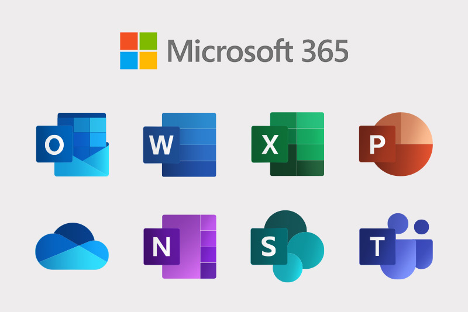

I've been thinking a lot about how fundamentally the way I work has changed in the last
six months, and how starting a company and being my own boss has made it possible.

Work "on the inside", at least from what I can tell, is lagging behind. Enterprise
adoption of AI faces serious security and governance challenges before it is adopted
into non-tech adjacent companies, and that means most people working inside companies
haven't seen what AI can really do. I think skepticism is justified until you experience
it yourself.

But I own my projects and the IT department (it's just me)... So I can do whatever I
want.

Maybe that gives me a worthwhile perspective on where work might be headed, because I
_am_ working, a lot, but it's... like, just different, man. Here are some thoughts.

## Do these products make sense anymore?

I wasn't born in tech, so my career started in the Microsoft world inside a non-tech
company. No git, no markdown, no code. Excel, Word, PowerPoint were the intellectual
currency passed between managers, and everyone joked about it, but nobody seemed to have
an alternative to offer, either.

Personally, I can't see why I would use these products ever again. They don't really
make sense anymore.



These kinds of products are built for a world where the average user doesn't have a
way to compile their work into rich outputs without significant investment in
programming. But technology has blown past that requirement, and I'm left questioning
what role these tools have left.

For example, when I need a professional document, it might be internal documentation, or
a contract, or a scope of work---documents where my writing voice doesn't really
matter[^voice], I just need to get information professionally formatted and sent to some
stakeholder---I don't open a word document and start typing. I chat to my agent. I
explain what I need done and I say I need it compiled to a PDF report. The agent knows
my formatting and templating, it knows where to do this work, it knows what tools to use
to compile to PDF, and it is an expert at the syntax required to do so. I work on the
document interactively with the agent, watching the PDF continuously compile in sync
with changes. I iterate on the document until satisfied. I then read through it, make
final manual edits, and then the job is done. In 10% of the time, I have a better
document than I would have bothered to write myself. Faster and better.

If I need a slide deck for a presentation, I don't start clicking around in PowerPoint.
I chat with my agent. I get it to generate an HTML presentation. It knows the styling
and template, so all the company faff will be included by default. I just need to
iterate on slide content with it. If the agent needs detailed background on the project,
I tell it where the code lives, and it reads up. No more explanation required.

If I need some numbers crunched, I don't open Excel and give myself eye strain. I open a
chat. I point my agent to where the data lives, whether its on my machine or the web,
and it inspects the data, generates a script on the fly to analyze it, and gives me the
information I asked for in a minute or so. 

If I need a repeatable analysis in an actual project, then spreadsheets are already out
of the question anyway, it's a coding job. And surprise, surprise, the coding agent is
very good at that, too. 

So if all this work, apart from real coding projects, because I still work at my desk
for that, amounts to _open a chat_, I don't see what the old tools are for.

Anthropic and OpenAI are adding integrations into Microsoft's productivity suite, but
I'd be surprised if any of them use it. They know it's not necessary, anymore, but
there's still huge money to make in the meantime.

## I'm organized now, apparently

And I've not just replaced those old tools... I'm also doing a bunch of things that I
never would have bothered with before.

I don't take take notes. Or at least I didn't... But now taking notes means _opening a
chat_. The agent commits the notes into my obsidian vault, which stores a knowledge
graph of all the goings on in my business, key projects I'm working on, areas of
learning, blog post ideas, and whatever else I throw at it. The agent can also read
email exchanges from my business account, sends me daily nudges about priorities, and
keeps the knowledge graph up to date without me needing to ask.

I can ask my agent to research a topic I'm interested in and create an HTML or PDF
report for me to read. I'll go out for a run and when I get back its all done, and I
have not only the report, but a conversation partner juiced to the gills with the
relevant context.

I do a lot of this from my phone. I don't need to open apps, move files around, click
and drag elements on a screen... All that is over for me. And good riddance!

This isn't AI psychosis---I'm not running 1000s of agents overnight, maxing out multiple
anthropic subscriptions on bonkers projects for clout on X. I'm just doing the stuff
that helps me work better, and it's currently cosing me 20 bucks a month. The rest of
the engagement-bait oriented stuff falls away pretty quickly when it doesn't actually
help you get good work done. Experiment, keep the good stuff, drop the rest, and move
on.

And to stress my real point here---not only can I work at a pace that was previously
inconceivable---it is universally a better experience. I don't miss the spreadsheets,
or the PowerPoints, and you'd have to pay me to go back.

## Nearly headless software

The experience I've had with all this has led me to believe that many applications are
going to become, nearly or completely, "headless"---lacking any serious frontend---and
be much better for it. If I can ask an agent to configure and run complex applications
from my phone, it won't be long before I stop opening the web-app altogether, and just
_open a chat_ instead. I'm more comfortable chatting on the couch than hunched over a
screen navigating forms and fancy widgets. The agent can send me back the details,
images, tables of data, whatever it might be. It's just a better experience.

Unless the user interface is indispensable for the workflow (seismic interpretation is
one such example, though there are doubtless many more across industries), an agent with
access to the right data and the right tools will just do it, or ask for clarification
and then do it. So, if you consider the most complex tasks you do at your job, unless
they involve precise clicking based on your expert judgment... it's couch potato time.
Tell the robot what you want, grab a coffee, and it'll ping you when it's ready to
discuss its findings. Iterate until completion.

I think that this will be the new shape of work: Agents controlling backend
applications, and you just...opening a chat to ask for things. The chat interface (maybe
a richer version of what we currently have---I have some thoughts there, but let's be
real, a million others do too) becomes the frontend hub of the backend spokes that your
business uses to do work. If
[your](https://nick-dorsch.github.io/blog/posts/spreadsheets/) _ahem_
[data](https://nick-dorsch.github.io/blog/posts/enso/) _ahem_
[infrastructure](https://nick-dorsch.github.io/blog/posts/databasin/) is set up for
this, it will transform your business completely.

```{mermaid}
flowchart BT
    U([User]) <--> C[Chat]

    C <--> A1[Agent A]
    C <--> A2[Agent B]
    C <--> A3[Agent C]

    A1 <---> D[(Data)]
    A2 <---> D
    A3 <---> D

    A1 <---> T[[Tools]]
    A2 <---> T
    A3 <---> T
```

Does this make the humans in the loop irrelevant? I don't think so. It gives us longer
levers to exercise our creativity and judgment with. Anthropic is hiring a lot of
engineers, they're at the cutting-edge and they still value that leverage. Those
qualities will become your worth, not your ability to click and clack at a workstation.
Expertise and good judgment is going to matter _a lot_. Long levers help you lift
things, and break things, after all.

## Problems on the inside

All this functionality is what coding agents already do, pretty much out of the box. The
problem is already solved if you own the machine you are working on, and can install
what you need to enable it... but this is where the friction begins at big companies.

How does enterprise get to widespread AI adoption? Deloitte's 2026 "State of AI in the
Enterprise"
[report](https://www.deloitte.com/au/en/issues/generative-ai/state-of-ai-in-enterprise.html)
notes AI adoption is on the rise, but the infrastructure and governance around it is
lagging. There are very real security concerns with AI agent deployment inside
companies, which may be brushed under the rug in favor of adoption before they are
solved. 

Big tech will invest billions into cracking this market, because they're already working
in the new way, and they know there is no going back.

Meanwhile, at least outside of silicon valley, start up founders and the... curious
unemployed (I drift each day on which of those categories I place myself in) are the
ones playing around most actively in the real AI sandpit, and discovering the new shape
of work.

Maybe AI on the inside still sucks, but boy am I moving fast and having fun out in the
wild (AKA, my couch).

[^voice]: For any emails, messages, social media posting or this blog---basically
anywhere with an expectation that it is _me_ communicating---AI writing is a strict
no-no for me. I find AI writing (at least in the context of social media engagement
farming) pretty awful to read and think its dishonest use is disingenuous and
disrespectful.  AI generated posting without clear disclaimers should be shunned and
removed from social media sites, in my view. When I catch myself using a "it's not just
this---it's also _that_" framing, a part of me dies inside, but it does happen. I also
enjoy em-dashes and think they help my writing flow better, though my writing skills are
a work in progress.
